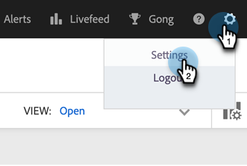

# Gmail 用 Sales Connect メールプラグインのインストール {#install-the-sales-connect-email-plugin-for-gmail}

Gmail プラグインのインストール方法を説明します。

>[!IMPORTANT]
>
>Gmail および Outlook 用メールプラグインは、Marketo Sales Connect ユーザのみがサポートされます。これらは、Sales Insight アクションユーザにはサポート&#x200B;**されません**。

1. [web アプリケーション ](https://toutapp.com/next#settings) で、歯車アイコンをクリックし、「**[!UICONTROL 設定]**」をクリックします。

   

1. 「マイアカウント」で、「**[!UICONTROL メール設定]**」をクリックします。

   

1. 「**[!UICONTROL プラグイン]**」タブをクリックします。

   

1. 「Gmail および Google アプリ」で、「**[!UICONTROL インストール]**」をクリックします。

   
