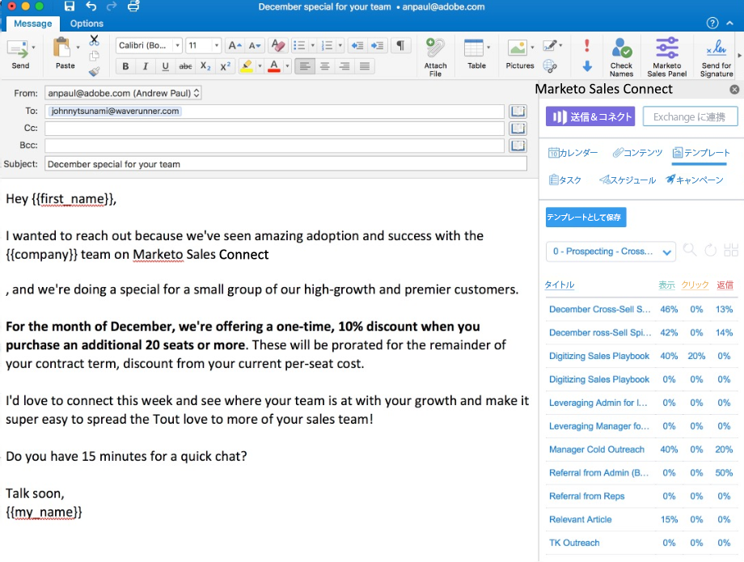

# Sales Connect Email Plugin for Outlook （Online、Mac、Windows）のインストール {#install-the-sales-connect-email-plugin-for-outlook}

Outlook web App との統合を作成しました。Outlook web App は、Office 365 サブスクリプションが付属する Outlook のバージョンです。ブラウザーベースなので、統合は Mac と Windows の両方で動作します。[完全なインストールガイドについては、ここをクリックしてください](https://s3.amazonaws.com/tout-user-store/outlook-mac/assets/install_tout_add-in_outlook_mac.pdf)。

管理者は、[チーム全体の代わりにインストール](https://docs.microsoft.com/ja-jp/office365/admin/manage/manage-deployment-of-add-ins?view=o365-worldwide)できます。

>[!IMPORTANT]
>
>Gmail と Outlook 用のメールプラグインは、Marketo Sales Connect ユーザーでのみサポートされています。 Sales Insight Actions ユーザーではサポートされていま **ん**。

>[!NOTE]
>
>ストアボタンがない場合は、最新バージョンの Outlook for Mac を使用していません。次の手順に従って、更新を行います。
>
>i. [ ヘルプ ] ボタン （上部のナビゲーションの [Outlook] の右側）に移動します
>
>ii.ドロップダウンメニューで「**更新を確認**」を選択します。
>
>iii.Outlook の最新バージョンに更新し、完了したら、次の手順に戻ります

>[!NOTE]
>
>.Net アドインは、Outlook からのメールスケジュールのサポートを停止しました。Office365 アドインを更新して、メールをスケジュールする必要があります。
