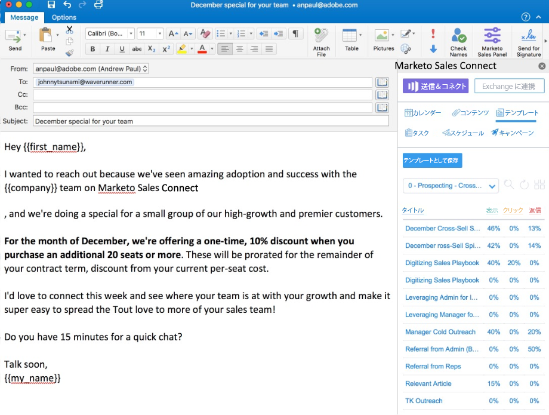

# Outlook（Online、Mac および Windows）用 Sales Connect メールプラグインのインストール {#install-the-sales-connect-email-plugin-for-outlook}

[!DNL Outlook Web Apps] との統合を作成しました。 [!DNL Outlook Web Apps] は、[!DNL Office 365] サブスクリプションで提供される [!DNL Outlook] のバージョンです。 ブラウザーベースなので、統合はMacと[!DNL Windows]の両方で機能します。 [完全なインストールガイドについては、ここをクリックしてください](https://s3.amazonaws.com/tout-user-store/outlook-mac/assets/install_tout_add-in_outlook_mac.pdf)。

管理者は、[チーム全体の代わりにインストール](https://docs.microsoft.com/ja-jp/office365/admin/manage/manage-deployment-of-add-ins?view=o365-worldwide)できます。

>[!IMPORTANT]
>
>Gmail および Outlook 用メールプラグインは、Marketo Sales Connect ユーザのみがサポートされます。 これらは、セールスインサイトアクションユーザにはサポート&#x200B;**されません**。

>[!NOTE]
>
>ストアボタンがない場合は、Macの最新バージョンの[!DNL Outlook]を使用していません。 次の手順に従って、アップデートを行います。
>
>私は。 ヘルプボタンに移動します（「Outlook」の右側にある一番上のナビゲーション）
>
>ii. ドロップダウンメニューで「**[!UICONTROL 更新を確認]**」を選択します。
>
>iii. 最新バージョンのOutlookに更新し、完了したら次の手順に戻ります

>[!NOTE]
>
>.Net アドインは、[!DNL Outlook] からのメールスケジュールのサポートを停止しました。 [!DNL Office365] アドインをアップデートして、メールをスケジュールする必要があります。
