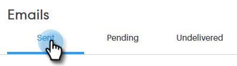
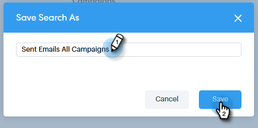

# 詳細検索の概要 {#advanced-search-overview}

詳細検索を利用して、メールを閲覧したりクリックしたり、メールに返信した見込み客をターゲットすることで、最もエンゲージメントの高い見込み客のターゲットリストを作成できます。

## 詳細検索へのアクセス方法 {#how-to-access-advanced-search}

1. 「**コマンドセンター**」をクリックします。

   

1. 「**メール**」をクリックします。

   

1. 該当するタブを選択します。

   

1. 「**詳細検索**」をクリックします。

   

## フィルター {#filters}

**日付**

検索の日付範囲を選択します。プリセット日付は、選択したメールステータス（送信済み、未配信、保留中）に応じて更新されます。

**対象者**

「対象者」セクションのメールの受信者／送信者でフィルタリングします。

| ドロップダウン | 説明 |
|---|---|
| **別のユーザーとして表示** | Sales Connect インスタンスの特定の送信者でフィルタリングします（このオプションは、管理者のみが利用できます）。 |
| **グループ別** | 特定の受信者グループでメールをフィルタリングします。 |
| **ユーザー別** | 特定の受信者でフィルタリングします。 |

**タイミング**

作成日、配信日、失敗した日付、スケジュールした日付別に選択します。使用可能なオプションは、選択したメールのステータス（送信済み、配信不能、保留中）に応じて異なります。

**キャンペーン**

キャンペーン参加でメールをフィルタリングします。

**ステータス**

選択できるメールステータスは 3 つあります。選択したステータスに応じて、タイプ／アクティビティのオプションが変わります。

***ステータス：送信済み***

送信したメールアクティビティ別にフィルタリングします。表示／表示なし、クリック／クリックなし、返信／返信なしを選択できます。

***ステータス：保留中***

保留中のすべてのメールでフィルタリングします。

| ステータス | 説明 |
|---|---|
| **スケジュール済み** | 作成ウィンドウ（Salesforce または Web アプリ）、メールプラグイン、またはキャンペーンからスケジュールされたメール。 |
| **下書き** | 現在ドラフト状態のメール。メールをドラフトとして保存するには、件名と受信者が必要です。 |
| **進行中** | 送信中のメール。メールがこの状態に保たれるのは数秒間ほどです。 |

***ステータス：未配信***

配信されなかったメールでフィルタリングします。

| ステータス | 説明 |
|---|---|
| **失敗** | Sales Connect からのメール送信に失敗した場合（一般的な理由は次のとおりです）。配信停止／ブロック済み連絡先に送信されているメール、または動的フィールドへの入力で問題が発生した場合）。 |
| **バウンス** | メールは、受信者のサーバーによって拒否された場合、バウンス済みとしてマークされます。Sales Connect サーバー経由で送信されたメールのみがここに表示されます。 |
| **スパム** | 受信者によってメールがスパム（迷惑メールの一般用語）としてマークされた場合。Sales Connect サーバー経由で送信されたメールのみがここに表示されます。 |

## 保存済みの検索結果 {#saved-searches}

保存済みの検索を作成する方法を次に示します。

1. すべてのフィルターを設定したら、「**フィルターに名前を付けて保存**」をクリックします。

   

1. 検索に名前を付け、「**保存**」をクリックします。

   

   保存した検索条件は、左側のサイドバーに表示されます。

   
