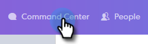

# アドバンス検索の概要 {#advanced-search-overview}

電子メールの表示、クリックまたは返信を行ったターゲット見込み客に対するアドバンス検索を利用して、最も関与の多い見込み客のターゲットリストを作成できます。

## アドバンス検索へのアクセス方法 {#how-to-access-advanced-search}

1. [ **コマンドセンター**]をクリックします。

   

1. 「 **電子メール**」をクリックします。

   

1. 該当するタブを選択します。

   

1. 「 **アドバンス検索**」をクリックします。

   

## フィルター {#filters}

**日付**

検索する日付範囲を選択します。 プリセット日は、選択した電子メールステータス（送信済み、未配信、保留中）に応じて更新されます。

**ユーザー**

「ユーザー」セクションの電子メール受信者/送信者でフィルタします。

| **表示** | Sales Connectインスタンスの特定の送信者でフィルターします（このオプションは、管理者のみが使用できます）。 |
|---|---|
| **グループ別** | 特定の受信者グループで電子メールをフィルターします。 |
| **個人別** | 特定の受信者でフィルターします。 |

**タイミング**

作成日、配信日、失敗日、または予定日を選択します。 選択した電子メールステータス（送信済み、未配信、保留中）に応じて、使用可能なオプションが変わります。

**キャンペーン**

キャンペーンパーティシペーションで電子メールをフィルターします。

**ステータス**

3つの電子メールステータスから選択できます。 タイプ/アクティビティのオプションは、選択したステータスに応じて変わります。

***ステータス：送信済み***

送信した電子メールアクティビティによるフィルター。 「表示/表示なし」、「クリック数/クリック数なし」、「返信/返信なし」のいずれかを選択できます。

***ステータス：保留中***

保留中のすべての電子メールによるフィルター。

| **スケジュール済み** | 構成ウィンドウ（SalesforceまたはWeb App）、電子メールプラグインまたはキャンペーンからスケジュールされた電子メール。 |
|---|---|
| **ドラフト** | 現在ドラフト状態の電子メール。 電子メールをドラフトとして保存するには、件名と受信者が必要です。 |
| **進行中** | 送信中の電子メール。 電子メールは、数秒間以上この状態に維持されません。 |

***ステータス：配信不能***

配信されなかった電子メールによるフィルター。

| **失敗** | Sales Connectからの電子メールの送信に失敗した場合(一般的な理由は次のとおりです。登録解除/ブロックされた連絡先に送信される電子メール、または動的フィールドへの入力で問題が発生した場合)。 |
|---|---|
| **バウンス** | 電子メールは、受信者のサーバーによって拒否された場合に、バウンスとしてマークされます。 Sales Connectサーバー経由で送信された電子メールのみが表示されます。 |
| **スパム** | 電子メールが受信者によってスパムとしてマークされた（非請求電子メールの一般的な用語）時。 Sales Connectサーバー経由で送信された電子メールのみが表示されます。 |

## 保存済みの検索結果 {#saved-searches}

保存検索を作成する方法を次に示します。

1. すべてのフィルターを設定したら、「フィルターに名前を付けて **保存**」をクリックします。

   

1. 検索に名前を付け、「 **保存**」をクリックします。

   

   保存済みの検索結果は左側のサイドバーに表示されます。

   

