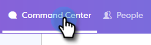
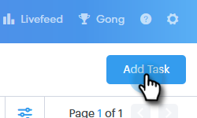
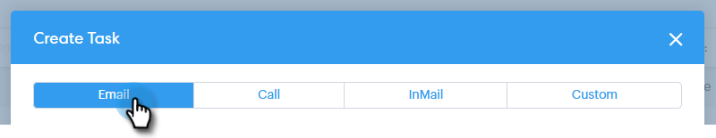
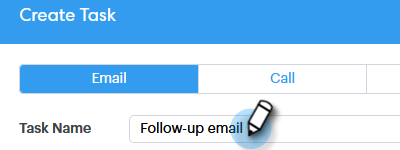
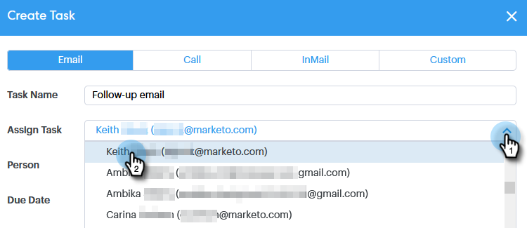
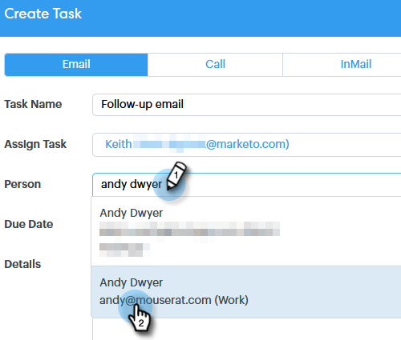
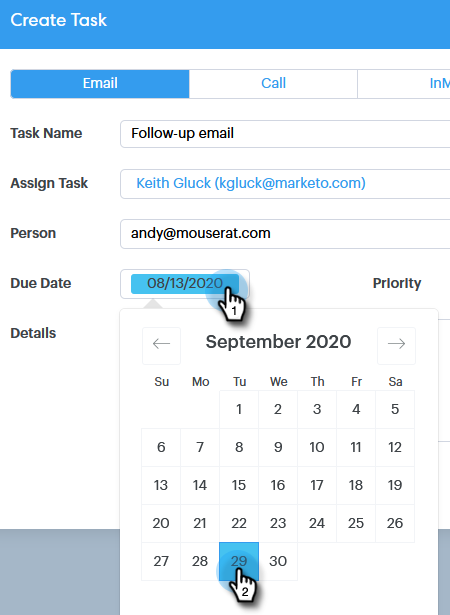
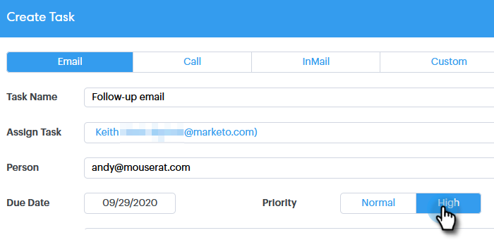
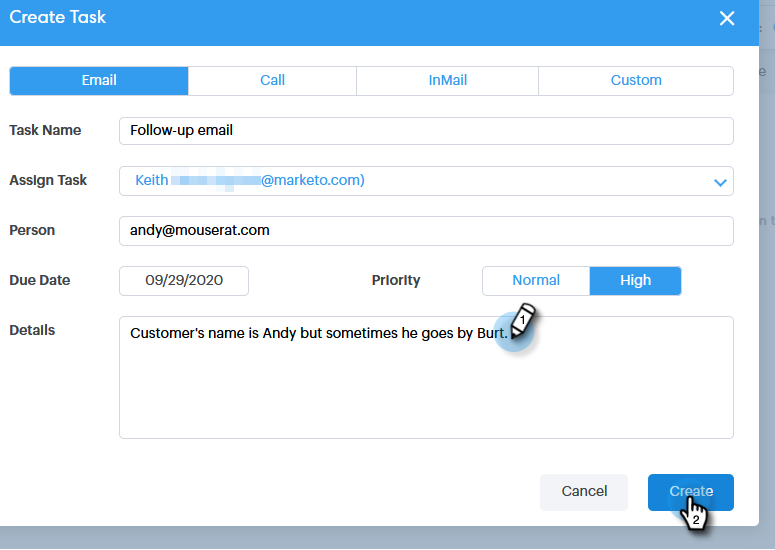

# チームメンバーへのタスクの割り当て&#x200B; {#assigning-tasks-to-team-members}

他のチームメンバーと共同作業を行う場合は、タスクを割り当てることで、見込み客の開拓作業を調整できます。

>[!NOTE]
>
>タスクの割り当ては、共有連絡先に対してのみ可能です。

1. 「**[!UICONTROL コマンドセンター]**」をクリックします。

   

1. 「**[!UICONTROL タスクを追加]**」をクリックします。

   

1. タスクタイプを選択します。

   

1. タスクに名前を付けます。

   

1. 「**[!UICONTROL タスクを割り当てる]**」フィールドで、タスクを割り当てるチームの担当者を選択します。

   

1. 「人物」フィールドに、該当する人物を追加します。

   

1. 「**[!UICONTROL 期限]**」を選択します。

   

1. 「**[!UICONTROL 優先度]**」を設定します。

   

1. チームメイトに関連する重要な詳細を追加し（オプション）、「**[!UICONTROL 作成]**」をクリックします。

   
