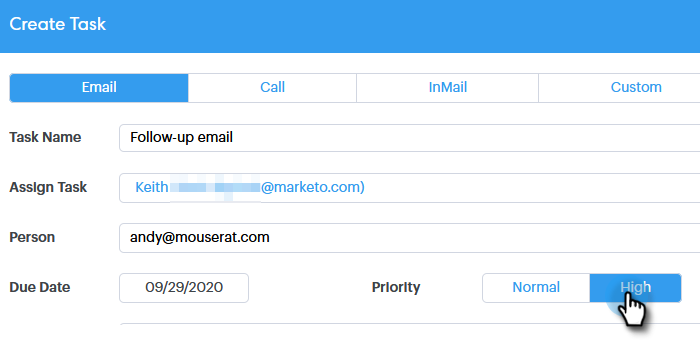

# チームメンバーへのタスクの割り当て {#assigning-tasks-to-team-members}

他のチームメンバーと共同作業を行う場合は、タスクを割り当てることで、潜在顧客を探し出す作業を調整できます。

>[!NOTE]
>
>タスクの割り当ては、共有連絡先に対してのみ可能です。

1. 「**[!UICONTROL コマンドセンター]**」をクリックします。

   

1. 「**[!UICONTROL タスクを追加]**」をクリックします。

   

1. タスクタイプを選択します。

   

1. タスクに名前を付けます。

   

1. タスクを割り当てるチームのユーザーを **[!UICONTROL タスクを割り当て]** フィールドで選択します。

   

1. 「人物」フィールドに、取引先責任者となる人物を追加します。

   

1. **[!UICONTROL 期限]** を選択します。

   

1. **[!UICONTROL 優先度]** を設定します。

   

1. チームメイトに関連する重要な詳細を追加し（オプション）、「**[!UICONTROL 作成]**」をクリックします。

   
