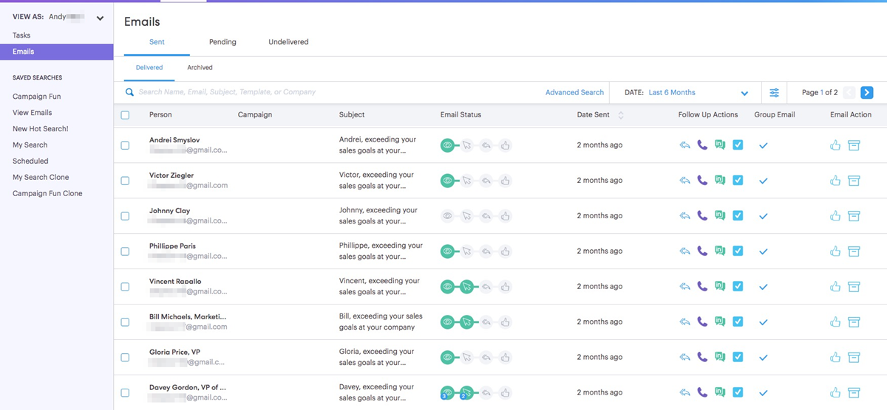
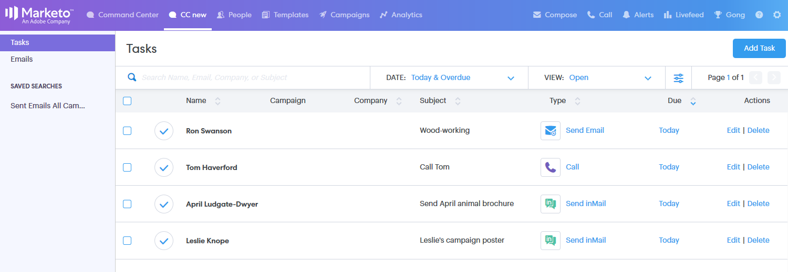

# コマンドセンターの概要 {#command-center-overview}

コマンドセンターは単一の統合ビューで、何も抜け落ちがないようにしながら次のステップを判断するのに役立ちます。

## メールの管理 {#manage-emails}

[!UICONTROL コマンドセンター]のメールセクションでは、すべてのメールアクティビティを管理できます。 [!DNL Sales Connect] から送信されたメールを確認するためのメール送信ボックスと考えてください。 スケジュールされたメールの管理、メールに関心を寄せている人の確認、メールの配信に問題があるかどうかの確認などを行います。

メールセクションでは、すべてのメールを俯瞰して、プライマリタブとサブタブを使用して組織を簡素化できます。プライマリタブとサブタブは、メールがステータスに基づいて自動的に保存されるフォルダーの役割を果たします。

<table>
 <colgroup>
  <col>
  <col>
  <col>
 </colgroup>
 <tbody>
  <tr>
   <td title="背景色：グレー">
<strong>プライマリ </strong>
</td>
   <td title="背景色：グレー">
<strong>サブ </strong>
</td>
   <td title="背景色：グレー">
<strong>説明 </strong>
</td>
  </tr>
  <tr>
   <td title="背景色：青"><strong title="">送信済み</strong></td>
   <td title="背景色：青">[!UICONTROL 配信済み]</td>
   <td title="背景色：青">受信者に配信されたメール。</td>
  </tr>
  <tr>
   <td title="背景色：青"> </td>
   <td title="背景色：青">[!UICONTROL アーカイブ済み]</td>
   <td title="背景色：青">メールのトラッキングを無効にするためにユーザーがアーカイブしたメール。</td>
  </tr>
  <tr>
   <td title="背景色：グレー"><strong title="">保留中</strong></td>
   <td title="背景色：グレー">[!UICONTROL スケジュール済み]</td>
   <td title="背景色：グレー">現在配信がスケジュールされているメール。 メールが送信されると、配信済みフォルダーに移動します。</td>
  </tr>
  <tr>
   <td title="背景色：グレー"> </td>
   <td title="背景色：グレー">[!UICONTROL ドラフト]</td>
   <td title="背景色：グレー">
下書きとして保存された電子メール。 <strong>注意：</strong>下書きとして保存できるのは、1通の電子メールのみです。 一括メール（「メールを選択して送信」と「メールをグループ化」）は下書きとして保存されません。
</td>
  </tr>
  <tr>
   <td title="背景色：グレー"> </td>
   <td title="背景色：グレー">[!UICONTROL 進行中]</td>
   <td title="背景色：グレー">これは、メールが送信処理中にあるときの中間的な状態です。 メールが「処理中」になるのは、通常ごく短時間だけです。</td>
  </tr>
  <tr>
   <td title="背景色：青"><strong title="">未配信</strong></td>
   <td title="背景色：青">[!UICONTROL 失敗]</td>
   <td title="背景色：青">配信に失敗したメール。</td>
  </tr>
  <tr>
   <td title="背景色：青"> </td>
   <td title="背景色：青">[!UICONTROL バウンス済み]</td>
   <td title="背景色：青">
受信者のメールサーバーから却下されたメール。  <strong>注意：</strong>これは、従来の ToutApp ユーザーで、配信チャネルとして MSC サーバーにアクセスできる場合にのみ検出されます。
</td>
  </tr>
  <tr>
   <td title="背景色：青"> </td>
   <td title="背景色：青">[!UICONTROL スパム]</td>
   <td title="背景色：青">
受信者によって手動で迷惑メールとしてマークされた電子メール。 <strong> メモ：</strong>これは、従来のToutApp ユーザーであり、配信チャネルとしてMSC サーバーにアクセスできる場合にのみ検出されます。
</td>
  </tr>
 </tbody>
</table>

## タスクの管理 {#manage-tasks}

タスクセクションは、タスクの管理と完了を一括して行える場所です。 タスクをシームレスに管理し、生産性を高め、最も関連性の高い項目に集中できます。

## エンゲージした見込み客のフォローアップ {#follow-up-with-engaged-prospects}

作成ウィンドウまたはキャンペーンを使用して見込み客とのエンゲージメントを開始したら、詳細検索機能を使用して、最もエンゲージメントの高い見込み客を再度ターゲティングできます。

例えば、MSC のキャンペーンに 100 人を追加する場合、メールを閲覧してクリックしたが返信しなかった人を再度ターゲティングしたいと考えるでしょう。 そのためには、表示およびクリックステータス[!UICONTROL アクティビティ]フィルターと共にキャンペーンフィルターを利用して、再度ターゲティングする人物のリストを特定します。

ボーナス：詳細検索を保存すると、動的リストとして機能し、受信者がメールを表示またはクリックすると、エンゲージメント条件を満たすメールが追加されます。

>[!MORELIKETHIS]
>
>* [タスク](/help/marketo/product-docs/marketo-sales-connect/tasks/syncing-sales-connect-tasks-with-salesforce-for-the-first-time.md)
>* [詳細検索の概要](/help/marketo/product-docs/marketo-sales-connect/email/command-center/advanced-search-overview.md)
>* [「選択して送信」による一括メールの作成](/help/marketo/product-docs/marketo-sales-connect/email/using-the-compose-window/composing-bulk-emails-with-select-and-send.md)
