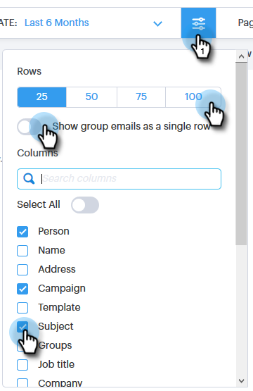

# 電子メール列と電子メールページレイアウト {#email-columns-and-email-page-layout}

コマンドセンターの電子メールセクションに表示する列を設定できます。 設定は、各電子メールサブフォルダー（配信済み、失敗、スケジュール済みなど）に保存されます。

## 電子メール列 {#email-columns}

<table> 
 <colgroup> 
  <col> 
  <col> 
 </colgroup> 
 <tbody> 
  <tr> 
   <th>
列
</th> 
   <th>説明</th> 
  </tr> 
  <tr> 
   <td>人</td> 
   <td>Sales Connectのユーザーの名前と電子メール。 このフィールドをクリックすると、個人の詳細表示の「情報」タブが開きます。</td> 
  </tr> 
  <tr> 
   <td>名前</td> 
   <td>Sales Connectのユーザーの名前。</td> 
  </tr> 
  <tr> 
   <td>住所</td> 
   <td>Sales Connect内のユーザーのプライマリの電子メールアドレス。</td> 
  </tr> 
  <tr> 
   <td>キャンペーン</td> 
   <td>電子メールがキャンペーンの一部として送信された場合は、キャンペーンの名前が表示されます。 このフィールドをクリックすると、そのキャンペーンのセットアップページが表示されます。</td> 
  </tr> 
  <tr> 
   <td>テンプレート</td> 
   <td>テンプレートの名前を表示します（電子メールと共に送信された場合）。</td> 
  </tr> 
  <tr> 
   <td colspan="1">件名</td> 
   <td colspan="1">電子メールの件名行。</td> 
  </tr> 
  <tr> 
   <td colspan="1">グループ</td> 
   <td colspan="1">電子メール受信者が属するグループを表示します。</td> 
  </tr> 
  <tr> 
   <td>肩書</td> 
   <td>電子メール受信者のタイトル。</td> 
  </tr> 
  <tr> 
   <td>会社</td> 
   <td>電子メール受信者の会社。</td> 
  </tr> 
  <tr> 
   <td>電子メールステータス</td> 
   <td>電子メールのステータス。 ステータスには次のものがあります。ドラフト、スケジュール済み、進行中、スパム、バウンス済み、失敗、送信済み。 送信された電子メールには、その電子メールで発生した表示、クリックおよび返信の数を示すアクティビティストリームが表示されます。</td> 
  </tr> 
  <tr> 
   <td>作成日</td> 
   <td>電子メールが作成された日付。</td> 
  </tr> 
  <tr> 
   <td>最終更新日</td> 
   <td>電子メールが最後に更新された日付。</td> 
  </tr> 
  <tr> 
   <td>配信チャネル</td> 
   <td>電子メールの送信に使用した配信チャネルの名前。</td> 
  </tr> 
  <tr> 
   <td>最新アクティビティ</td> 
   <td>電子メール受信者による最後のエンゲージメント(表示、クリック、返信など)</td> 
  </tr> 
  <tr> 
   <td>送信日</td> 
   <td>電子メールが送信された日付。</td> 
  </tr> 
  <tr> 
   <td>フォローアップアクション</td> 
   <td>電子メール、電話、inMail、タスクによるフォローアップに使用できるクイックアクションボタンです。</td> 
  </tr> 
  <tr> 
   <td>グループ電子メール</td> 
   <td>電子メールがグループ電子メールの一部として送信された場合は、チェックマークを表示します。</td> 
  </tr> 
  <tr> 
   <td>タスク期限</td> 
   <td>電子メールに関連するタスクの期日が表示されます。 タスクは、電子メールリストのクイックアクションボタンから作成することで、電子メールに関連付けることができます。</td> 
  </tr> 
  <tr> 
   <td>電子メールアクション</td> 
   <td>電子メールに対してアクションを実行するために使用できるクイックアクションボタン。 電子メールのステータスに応じて、次の操作を実行できます。アーカイブ、成功、削除、送信の再試行、アーカイブ解除。</td> 
  </tr> 
  <tr> 
   <td>タスクタイプ</td> 
   <td>電子メールに関連するタスクのタスクタイプを表示します。 タスクは、電子メールリストのクイックアクションボタンから作成することで、電子メールに関連付けることができます。</td> 
  </tr> 
  <tr> 
   <td>失敗した日付</td> 
   <td>電子メールが配信されなかった場合に電子メールが失敗した日付を示します。</td> 
  </tr> 
 </tbody> 
</table>

## 電子メールページレイアウトの設定 {#email-page-layout-settings}

次の手順に従って、レイアウトを設定できます。

1. コマンドセンターに移動します。

   

1. 「 **電子メール** 」セクションを選択します。

   

1. 設定ボタンをクリックします。 次のオプションがあります。行数の選択、表示するフィールドの選択、グループ電子メールをグリッド内の1つの項目にロールアップするかどうかの選択（または電子メールグリッドに含まれるすべての電子メールを1つの項目として表示する場合）。

   

1. 完了したら、設定の外側をクリックするだけです。

