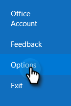
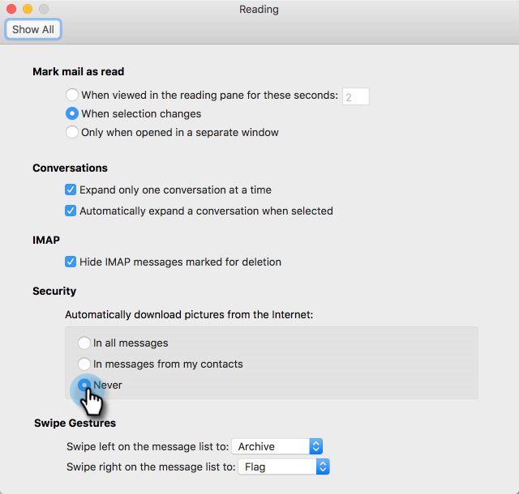

# 自己表示の防止 {#preventing-self-views}

## 概要 {#overview}

表示の追跡で偽陽性を発生させると、レポートの不一致を招く可能性があります。 これは、MSCのユーザーが電子メールクライアントから誤ってトラッキングピクセルを呼び出した場合によく発生します(これを自己表示と呼びます)。 以下に、自己表示を大幅に削減し、排除する方法に関するいくつかのヒントを示します。

## Web （Outlook Web AppとGmail） {#web-outlook-web-app-and-gmail}

Sales Connectは、Outlook Web AppやGmailから電子メールを開く際に表示が追跡されないようにCookieをブラウザに保存します。 まだ自己表示を受け取っている場合は、次の操作を行うことをお勧めします。

* コンピューターでCookieが有効になっていることを確認します。

* 新しいコンピューターまたはモバイルデバイスを使用している場合は、Webアプリケーションにログインしていることを確認してください。 これにより、今後のコンピューター/デバイスを認識できます。

## デスクトップ(Windows) {#desktop-windows}

表示は、電子メールクライアントで小さな目に見えない画像ピクセルをダウンロードすることで追跡されます。 Outlookでは、表示の自動ダウンロードを無効にすることで、自分のイメージの量を大幅に減らすことができます。 手順は次のとおりです。

1. Outlookで、メニューバーの **[ファイル** ]をクリックします。

   

1. 「 **オプション**」をクリックします。

   

1. [Outlookのオプション]ダイアログボックスで、[ **セキュリティセンター**]をクリックします。

   

1. [Microsoft Outlookセキュリティセンター]で、[ **セキュリティセンターの設定**]をクリックします。

   

1. 左側のメニューで[自動ダウンロード]をクリックし、[ HTML電子メールまたはRSSアイテムで画像を自動的にダウンロードしない **** ]チェックボックスをオンにします。

   

1. セキュリティセンターダイアログボックスで **「OK** 」をクリックします。

   

1. [Outlookのオプション]ダイアログボックスで **[OK** ]をクリックします。

   

## デスクトップ(Mac) {#desktop-mac}

表示は、電子メールクライアントで小さな目に見えない画像ピクセルをダウンロードすることで追跡されます。 Outlookでは、表示の自動ダウンロードを無効にすることで、自分のイメージの量を大幅に減らすことができます。 手順は次のとおりです。

1. Outlookで、メニューバーの **Outlook** をクリックし、「 **環境設定**」を選択します。

   

1. 「電子メール」で、「 **読み取り中**」を選択します。

   

1. 「セキュリティ」で、「 **なし** 」ラジオボタンをクリックします。

   

