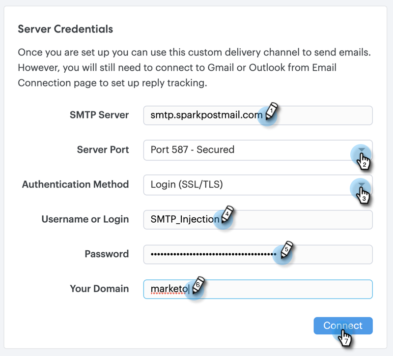

# カスタム配信チャネルの設定 {#setting-up-a-custom-delivery-channel}

Marketo Sales Connect を使用すると、カスタム SMTP サーバーを統合してメールを配信できます。これは、Gmail や Exchange の配信チャネルから一括メールを送信しない場合に最適です。

ユーザーは、個々の使用に合わせてカスタム SMTP サーバーを設定することができます。また、管理者は、インスタンス内のすべての Sales Connect ユーザーで共有されるチーム SMTP を設定することができます。

>[!NOTE]
>
>* SMTP サーバーの設定に加えて、メールを送信する前に[メール ID を検証](/help/marketo/product-docs/marketo-sales-connect/getting-started/email-settings/verify-your-email.md)する必要があります。
>* お使いの SMTP サーバーに適したサーバークレデンシャルを取得するには、IT チームまたは SMTP サーバーのベンダーと協力することをお勧めします。
>* SMTP サーバーのクレデンシャルを使用して Gmail サーバーや Exchange サーバーに接続することはできません。これらのプロバイダーとの統合には、アドビのメール接続サービスをご利用ください。

## カスタム SMTP {#custom-smtp}

1. [web アプリケーション](https://toutapp.com/login)にログインし、右上の歯車アイコンをクリックして、「**設定**」を選択します。

   

1. 「マイアカウント」で、「**メール設定**」をクリックします。

   

1. 「**カスタム配信チャネル**」をクリックします。

   

1. SMTP サーバーのクレデンシャルを入力し、「**接続**」をクリックします。

   

   >[!NOTE]
   >
   >これが唯一の配信チャネルの場合、すべてのメール ID に自動的に割り当てられるため、ここで完了です。これが唯一の配信チャネルでない場合は、手順 5 に進んでください。

1. メール設定で、「**アドレスと署名**」をクリックします。

   

1. 配信チャネルを選択するメール ID を見つけ、「**配信チャネルを選択**」を選択します。

   

1. 配信品質カードで、「**編集**」をクリックします。

   

1. チャネルドロップダウンをクリックし、先ほど追加したカスタム配信チャネルを選択します。「**保存**」をクリックします。

   

   >[!NOTE]
   >
   >チーム管理者がチーム SMTP サーバーを設定すると、これはデフォルトのメール ID にのみ自動的に適用され、他のメール ID のオプションとして使用できます。

## チーム SMTP サーバー {#team-smtp-server}

>[!NOTE]
>
>**管理者権限が必要**

1. [web アプリケーション](https://toutapp.com/login)にログインし、右上の歯車アイコンをクリックして、「**設定**」を選択します。

   

1. 「管理設定」で、「**一般**」をクリックします。

   

1. 「**チーム配信チャネル**」をクリックします。

   

1. SMTP サーバーのクレデンシャルを入力し、「**接続**」をクリックします。

   

   >[!NOTE]
   >
   >チーム SMTP サーバーは、すべてのチームメンバーのデフォルトのメール ID のデフォルト配信チャネルになります。さらに、他のすべてのメール ID の配信チャネルオプションとして使用できます。

   >[!MORELIKETHIS]
   >
   >* [Gmail ユーザーのメール接続](/help/marketo/product-docs/marketo-sales-connect/email-plugins/gmail/email-connection-for-gmail-users.md)
   >
   >* [Outlook ユーザーのメール接続](/help/marketo/product-docs/marketo-sales-connect/email-plugins/msc-for-outlook/email-connection-for-outlook-users.md)

