# カスタム配信チャネルの設定 {#setting-up-a-custom-delivery-channel}

[!DNL Marketo Sales Connect] を使用すると、カスタム SMTP サーバーを統合してメールを配信できます。 これは、Gmail や [!DNL Exchange] の配信チャネルから一括メールを送信しない場合に最適です。

ユーザは、個々の使用に合わせてカスタム SMTP サーバーを設定できます。また、管理者は、インスタンス内のすべての [!DNL Sales Connect] ユーザで共有されるチーム SMTP を設定できます。

>[!NOTE]
>
>* SMTP サーバーの設定に加えて、メールを送信する前に、[メール ID を認証する必要があります](/help/marketo/product-docs/marketo-sales-connect/getting-started/email-settings/verify-your-email.md)。
>* お使いの SMTP サーバーに適したサーバー資格情報を取得するには、IT チームまたは SMTP サーバーのベンダーと協力することをお勧めします。
>* SMTP サーバーの資格情報を使用して Gmail サーバーや [!DNL Exchange] サーバーに接続できません。 これらのプロバイダーとの統合には、アドビのメール接続サービスを使用してください。

## カスタム SMTP {#custom-smtp}

1. [web アプリケーション](https://toutapp.com/login)にログインし、右上の歯車アイコンをクリックして、「**[!UICONTROL 設定]**」を選択します。

   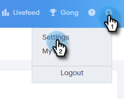

1. 「[!UICONTROL マイアカウント]」で、「**[!UICONTROL メール設定]**」をクリックします。

   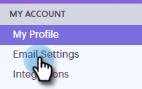

1. 「**[!UICONTROL カスタム配信チャネル]**」をクリックします。

   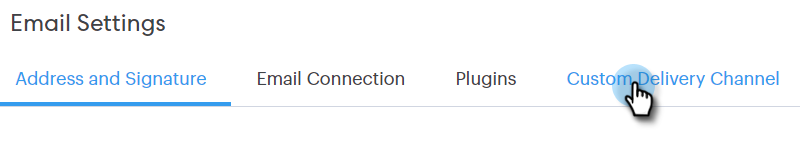

1. [!UICONTROL SMTP サーバー]の資格情報を入力し、「**[!UICONTROL 接続]**」をクリックします。

   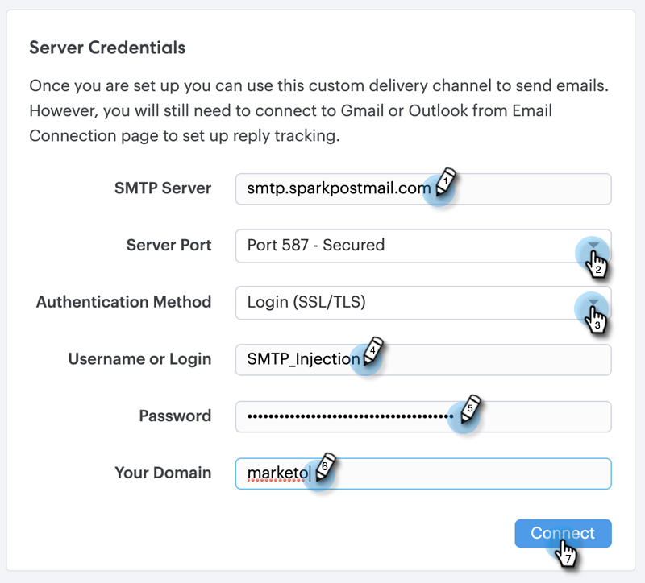

   >[!NOTE]
   >
   >これが唯一の配信チャネルの場合、すべてのメール IDに自動的に割り当てられ、ここで完了です。 これが唯一の配信チャネルでない場合は、手順 5 に進んでください。

1. 「[!UICONTROL メール設定]」で、「**[!UICONTROL アドレスと署名]**」をクリックします。

   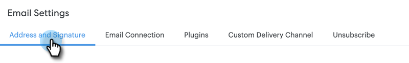

1. 配信チャネルを選択するメール ID を見つけ、「**[!UICONTROL 配信チャネルを選択]**」を選択します。

   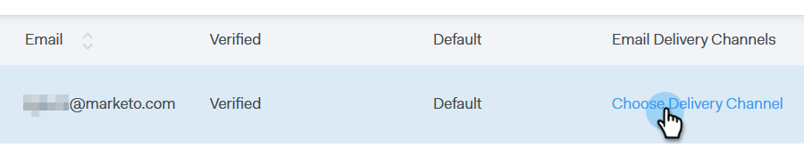

1. [!UICONTROL 配信品質]カードで、「**[!UICONTROL 編集]**」をクリックします。

   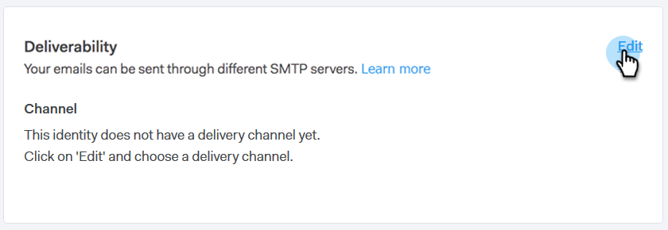

1. [!UICONTROL チャネル]ドロップダウンをクリックし、先ほど追加したカスタム配信チャネルを選択します。 「**[!UICONTROL 保存]**」をクリックします。

   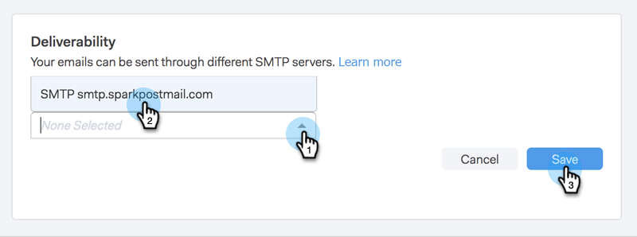

   >[!NOTE]
   >
   >チーム管理者がチーム SMTP サーバーを設定すると、これはデフォルトのメール ID にのみ自動的に適用され、他のメール ID のオプションとして使用できます。

## チーム SMTP サーバー {#team-smtp-server}

>[!NOTE]
>
>**管理者権限が必要**

1. [web アプリケーション](https://toutapp.com/login)にログインし、右上の歯車アイコンをクリックして、「**[!UICONTROL 設定]**」を選択します。

   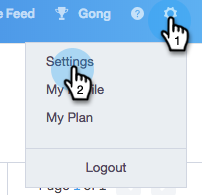

1. 「[!UICONTROL 管理者設定]」で、「**[!UICONTROL 一般]**」をクリックします。

   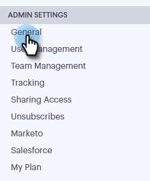

1. 「**[!UICONTROL チーム配信チャネル]**」をクリックします。

   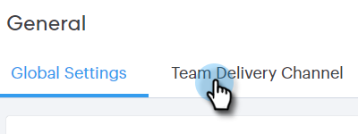

1. [!UICONTROL SMTP サーバー]の資格情報を入力し、「**[!UICONTROL 接続]**」をクリックします。

   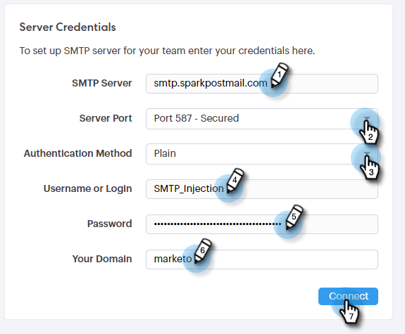

   >[!NOTE]
   >
   >チーム SMTP サーバーは、すべてのチームメンバーに対するデフォルトのメール ID のデフォルトの配信チャネルになります。 さらに、その他のすべてのメール ID の配信チャネルオプションとして使用できます。

   >[!MORELIKETHIS]
   >
   >* [Gmail ユーザのメール接続](/help/marketo/product-docs/marketo-sales-connect/email-plugins/gmail/email-connection-for-gmail-users.md)
   >
   >* [&#x200B; [!DNL Outlook]  ユーザのメール接続](/help/marketo/product-docs/marketo-sales-connect/email-plugins/msc-for-outlook/email-connection-for-outlook-users.md)
