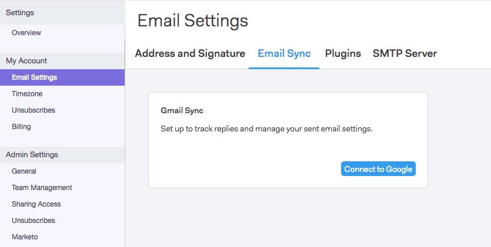

# SMTPサーバーの設定 {#setting-up-an-smtp-server}

## 概要 {#overview}

**SMTPサーバーとは何ですか？**

**** Simple **** Mail **** Transfer **** Protocol、これは送信メールの送信を担当するサーバーです。 電子メールクライアントから電子メールを送信する場合、このサービスを使用して電子メールを配信します。

**Sales Connectを使用してSMTPサーバーを設定する理由を教えてください。**

会社のドメインと配信品質の評判を活用し、他のユーザーの信頼を得る必要をなくします。 デフォルトのMSCサーバーは共有IPプールの一部であり、共有された評判から送信されます。 お客様のチームがSales Connectとの配信チャネルを独自に設定することを強くお勧めします。

**Sales ConnectはSMTPサーバーと共にどのように送信されますか。**

次の手順 [に従います](http://docs.marketo.com/x/ZgPh)。

`<pre><em>SMTP Server Setup Page in Sales Connect</em>  </pre>` **電子メールクライアントに何か設定する必要がありますか。**

配信のチャネルに関しては、いいえ。 アドインをインストールすると、Sales Connectは、電子メールの送信用に設定したのと同じ配信チャネルを利用します。

## SMTP秘密鍵証明書の取得 {#getting-the-smtp-credentials}

**SMTP資格情報の取得方法**

ITチームに連絡して、会社が電子メールの送信に使用している配信チャネルと、SMTP資格情報へのアクセス方法を調べます。 サーバーの設定に応じて、「SMTP Server Name」または「Server Port」に対するカスタム値がいくつかあります。 専用のITチームがいない場合は、電子メールプロバイダーにお問い合わせください。

**会社でOffice365を使用している場合、選択肢は何ですか？**

長所

* 容易なセットアップ
* Office365アカウントを持つユーザーは、このSMTPサーバーにアクセスできます

短所

* ジョブ数の制限が発生する可能性がある
* 各ユーザーが自分で設定する必要があります
* ユーザーのO365パスワードを変更すると、接続が切断されます

Office365またはExchange Onlineを使用している場合は、標準の資格情報セットを使用してSMTPサーバーに接続できます。 Office365は一括電子メール配信サービスではありませんが、1回限りの電子メールを送信する場合に適しています。 一括電子メールを送信する際、Office365では電子メールの送信が制限され、配信の失敗の原因となる場合があります。 この詳細については、SMTPクライアント送信の設定 [方法に関するMicrosoftの記事を参照してください](http://support.office.com/en-us/article/how-to-set-up-a-multifunction-device-or-application-to-send-email-using-office-365-69f58e99-c550-4274-ad18-c805d654b4c4)。
`<blockquote>  
“You can only send from one email address unless your device can store login credentials for multiple Office 365 mailboxes. Office 365 imposes a limit of 30 messages sent per minute, and a limit of 10,000 recipients per day.”
 </blockquote>`\
Office365を配信チャネルとして使用する場合は、これらの資格情報を入力する必要があります。 Office365はユーザーの電子メールとパスワードを使用して接続するので、チーム全体で同じ資格情報を使用することはできません。

Microsoftおよび一括送信

[Office365での一括送信については](http://technet.microsoft.com/en-us/library/exchange-online-limits.aspx#RecipientLimits) 、ここをクリックしてください。
`<blockquote>  
“Exchange Online customers who need to send legitimate bulk commercial email (for example, customer newsletters) should use third-party providers that specialize in these services.”
 </blockquote>`\
**私の会社がGmailを使っていたら？**

Sales Connectとの配信チャネルとしてGmailを使用する場合は、SMTP資格情報を取得する必要はありません。 Sales Connectを使用すると、OAuth統合を通じてGmail配信チャネルにアクセスできます。 ユーザーは、Sales ConnectアカウントをGmailと統合することで、これを有効にできます。

**同じSMTP資格情報をチーム全体で共有できますか。**

これは、使用している配信チャネルによって異なります。 例えば、Sparkpostなどのサービスでは、資格情報をドメインベースにすることができるので、特定のドメインで送信するユーザーは誰でも認証され、そのサーバーを介して送信されます。 その場合は、「はい」をクリックして、資格情報をチームと共有できます。

Office365に接続している場合、資格情報は電子メールアドレスベースです。 つまり、配信を確立した電子メールアドレスのみが認証され、接続チャネル経由で電子メールを送信できるので、秘密鍵証明書は共有し **ないでください** 。

