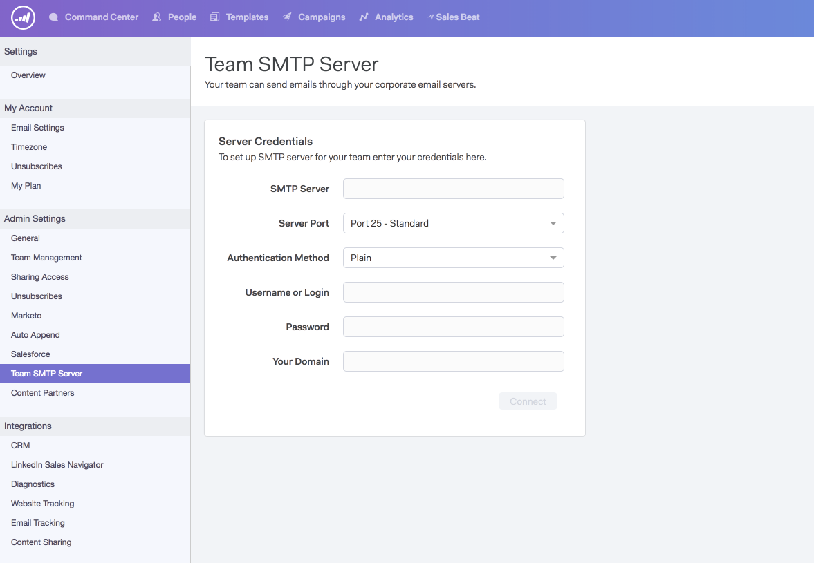

# SMTPサーバーの設定{#setting-up-an-smtp-server}

## 概要{#overview}

**SMTPサーバーとは何ですか？**

**** Simple  **** Mail  **** Transfer  **** Protocol、これは送信メールの送信を担当するサーバーです。電子メールクライアントから電子メールを送信する場合、このサービスを使用して電子メールを配信します。

**Sales Connectを使用してSMTPサーバーを設定する理由を教えてください。**

会社のドメインと配信品質の評判を活用し、他のユーザーの信頼を得る必要をなくします。 デフォルトのMSCサーバーは共有IPプールの一部であり、共有された評判から送信されます。 お客様のチームがSales Connectとの配信チャネルを独自に設定することを強くお勧めします。

**Sales ConnectはSMTPサーバーと共にどのように送信されますか。**

[次の手順](https://docs.marketo.com/x/ZgPh)に従います。

`<pre><em>SMTP Server Setup Page in Sales Connect</em>  </pre>` **電子メールクライアントに何か設定する必要がありますか。**

配信のチャネルに関しては、いいえ。 アドインをインストールすると、Sales Connectは、電子メールの送信用に設定したのと同じ配信チャネルを利用します。

## SMTP資格情報の取得{#getting-the-smtp-credentials}

**SMTP資格情報の取得方法**

ITチームに連絡して、会社が電子メールの送信に使用している配信チャネルと、SMTP資格情報へのアクセス方法を調べます。 サーバーの設定に応じて、「SMTP Server Name」または「Server Port」に対するカスタム値がいくつかあります。 専用のITチームがいない場合は、電子メールプロバイダーにお問い合わせください。

**会社でOffice365を使用している場合、選択肢は何ですか？**

長所

* 容易なセットアップ
* Office365アカウントを持つユーザーは、このSMTPサーバーにアクセスできます

短所

* ジョブ数の制限が発生する可能性がある
* 各ユーザーが自分で設定する必要があります
* ユーザーのO365パスワードを変更すると、接続が切断されます

Office365またはExchange Onlineを使用している場合は、標準の資格情報セットを使用してSMTPサーバーに接続できます。 Office365は一括電子メール配信サービスではありませんが、1回限りの電子メールを送信する場合に適しています。 一括電子メールを送信する際、Office365では電子メールの送信が制限され、配信の失敗の原因となる場合があります。 このチェックの詳細については、Microsoftの[SMTPクライアント送信の設定方法](https://support.office.com/en-us/article/how-to-set-up-a-multifunction-device-or-application-to-send-email-using-office-365-69f58e99-c550-4274-ad18-c805d654b4c4)に関する記事を参照してください。

&quot;1つの電子メールアドレスからのみ送信できます。ただし、デバイスがOffice 365の複数のメールボックスのログイン資格情報を保存できる場合を除きます。 Office 365には、1分あたり30通のメッセージを送信する制限と、1日あたり10,000受信者の制限が定められています。」

Office365を配信チャネルとして使用する場合は、これらの資格情報を入力する必要があります。 Office365はユーザーの電子メールとパスワードを使用して接続するので、チーム全体で同じ資格情報を使用することはできません。

Microsoftおよび一括送信

[Office 365での一括送信につ](https://technet.microsoft.com/en-us/library/exchange-online-limits.aspx#RecipientLimits) いては、ここをクリックしてください。

正当な一括商用の電子メール（お客様のニュースレターなど）を送信する必要があるExchange Onlineのお客様は、これらのサービスを専門とするサードパーティのプロバイダを使用する必要があります。」

**私の会社がGmailを使っていたら？**

Sales Connectとの配信チャネルとしてGmailを使用する場合は、SMTP資格情報を取得する必要はありません。 Sales Connectを使用すると、OAuth統合を通じてGmail配信チャネルにアクセスできます。 ユーザーは、Sales ConnectアカウントをGmailと統合することで、これを有効にできます。

**同じSMTP資格情報をチーム全体で共有できますか。**

これは、使用している配信チャネルによって異なります。 例えば、Sparkpostなどのサービスでは、資格情報をドメインベースにすることができるので、特定のドメインで送信するユーザーは誰でも認証され、そのサーバーを介して送信されます。 その場合は、「はい」をクリックして、資格情報をチームと共有できます。

Office365に接続している場合、資格情報は電子メールアドレスベースです。 つまり、配信を確立した電子メールアドレスだけが、接続チャネルを介して電子メールを送信するように認証されるので、資格情報は&#x200B;**共有しないでください。**

