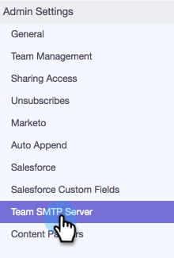
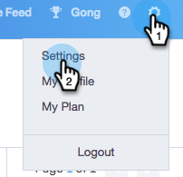
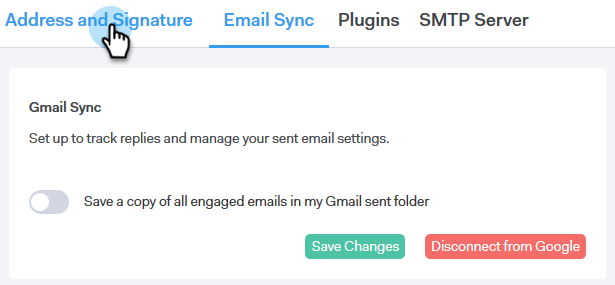

# 配信チャネルのセットアップ{#setting-up-your-delivery-channel}

Marketo Sales Connectを使用して開始を行う場合、電子メールを送信するには、SMTPサーバーを設定する必要があります。

>[!NOTE]
>
>SMTPサーバーを設定するだけでなく、電子メールを送信する前に、[電子メールIDを確認](/help/marketo/product-docs/marketo-sales-connect/getting-started/email-settings/verify-your-email.md)する必要があります。

カスタムSMTPサーバー、チームSMTPサーバー、またはGmailを配信チャネルとして使用して電子メールを送信するよう選択できます。 選択肢を一つ一つ見てみましょう。

## カスタムSMTP {#custom-smtp}

1. [Webアプリケーション](https://toutapp.com/login)にログインし、右上の歯車アイコンをクリックして、「**設定**」を選択します。

   

1. 「マイアカウント」で、「**電子メール設定**」をクリックします。

   

1. 「**SMTP Server**」を選択します。

   

1. SMTP Serverの資格情報を入力し、「**接続**」をクリックします。

   

   >[!NOTE]
   >
   >これが唯一の配信チャネルの場合は、すべての電子メールIDに自動的に割り当てられ、ここで処理が完了します。 これが配信チャネル以外の場合は、手順5に進んでください。

1. 「電子メールの設定」に進んだまま、「**アドレスと署名**」をクリックします。

   

1. 配信チャネルを選択する電子メールIDを探し、**配信チャネルを選択**&#x200B;をクリックします。

   

1. 配信品質カードで、「**編集**」をクリックします。

   

1. 「チャネル」ドロップダウンをクリックし、先ほど追加したカスタム配信チャネルを選択します。 「**保存**」をクリックします。

   

   >[!NOTE]
   >
   >チーム管理者がチームSMTPサーバーを設定すると、そのサーバーは自動的にデフォルトの電子メールIDにのみ適用され、他の電子メールIDのオプションとして使用できます。

## チームSMTPサーバー{#team-smtp-server}

>[!NOTE]
>
>**必要な管理者権限**

1. [Webアプリケーション](https://toutapp.com/login)にログインし、右上の歯車アイコンをクリックして、「**設定**」を選択します。

   

1. 「管理設定」で、「**チームSMTPサーバー**」をクリックします。

   

1. SMTP Serverの資格情報を入力し、「**接続**」をクリックします。

   

   >[!NOTE]
   >
   >チームSMTPサーバーは、すべてのチームメンバーの既定の電子メールIDの既定の配信チャネルです。 さらに、他のすべての電子メールIDの配信チャネルオプションとしても使用できます。

## Gmail {#gmail}

1. [Webアプリケーション](https://toutapp.com/login)にログインし、右上の歯車アイコンをクリックして、「**設定**」を選択します。

   

1. 「マイアカウント」で、「**電子メール設定**」をクリックします。

   

1. 「**電子メール同期**」をクリックします。

   

1. 「**Googleに接続**」をクリックします。

   

1. Googleの資格情報を使用してサインインします。

1. この画面に移動したら、「**許可**」をクリックします。

   

   >[!NOTE]
   >
   >これが唯一の配信チャネルの場合は、すべての電子メールIDに自動的に割り当てられ、ここで処理が完了します。 配信チャネルがGmailだけでない場合は、手順7に進んでください。

1. 「**アドレスと署名**」をクリックします。

   

1. Gmailを配信チャネルにする電子メールIDをクリックします。

   

1. スライドパネルが開いたら、「Deliverability Card」まで下にスクロールします。

   

1. 「チャネル」ドロップダウンをクリックし、先ほど追加したGmail配信チャネルを選択します。 「**保存**」をクリックします。

   

   >[!NOTE]
   >
   >チーム管理者がチームSMTPサーバーを設定すると、そのサーバーは自動的にデフォルトの電子メールIDにのみ適用され、他の電子メールIDのオプションとして使用できます。
