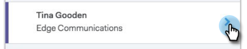

# ライブフィードの概要{#live-feed-overview}

ライブフィードは、WebアプリケーションまたはGmailプラグインから起動できるフローティングウィンドウで、オファーは見込み客の関与をリアルタイムで調べます。

## エンゲージメントタブ{#engagement-tab}

MSE電子メールに対するエンゲージメント(表示、クリックおよび返信)をリアルタイムで確認する。

紫の印が付いた人がマーケティングコンテンツに関心を持っています。 MSEには存在しない可能性があります。 下向き矢印をクリックすると、クイックアクションを追加できます。また、他のクイックアクションのリストを表示することもできます。

青い線の付いた訪問者は、MSE経由で送信された電子メールとのエンゲージメントを表します。

>[!NOTE]
>
>全体的に、IPトラッキングに基づいて、可能な限り正確に場所を特定します。 残念ながら、正確な科学ではありません。 お使いの受信者の1つで場所が間違っている場合、何が起きたかに関するいくつかの選択肢があります。
>
>* お客様の受信者が、別の市区町村や国にIT本部を置く会社のワイヤレスネットワークにログインしていた場合、受信者の現在のロケールではなく、その場所にログインする必要があります。
>* [CC/BCC]フィールドに電子メールが転送されたか、開かれた場合は、その人の場所を正確に表示するようにします。

>

## [タスク]タブ{#tasks-tab}

Live FeedからTODOリストをすばやく確認します。

新規作成するか、オープンタスクを管理します。

今日、明日、今日&#x200B;*、明日*、または次の7日間をフィルターします。

>[!NOTE]
>
>Live Feedではカスタムの日付フィルターを使用できませんが、Webアプリケーションでは使用できます。

クイックアクションボタンを使用して、すばやく呼び出しを行ったり、電子メールを送信したり、人のLinkedinプロファイルに移動したりできます。

## ターゲットタブ{#target-tab}

リードスコア別にランク付けされた上位の人（上位から下位に順番付けされた）を確認する。 リードスコアは、Marketoインスタンスから引き出されます。

* 顧客のスコアがマーケティングで増加すると、リードが生成されます。
* 上位50件のリードを表示します。
* Salesforceで割り当てられたユーザーのみが表示されます。

## アイコンの用語集{#icon-glossary}

<table> 
 <colgroup> 
  <col> 
  <col> 
 </colgroup> 
 <tbody> 
  <tr> 
   <td> 
    
 
     

 
    
</td> 
   <td>
他のユーザーが電子メールを表示しました
</td> 
  </tr> 
  <tr> 
   <td> 
    
 
     

 
    
</td> 
   <td>
誰かが電子メール内のリンクをクリックしました
</td> 
  </tr> 
  <tr> 
   <td> 
    
 
     

 
    
</td> 
   <td>
メールに返信した人
</td> 
  </tr> 
  <tr> 
   <td colspan="1"> 
    
 
     

 
    
</td> 
   <td colspan="1">電子メール、Web、マイルストーンを含む、「注目の場面」に一覧表示される通知</td> 
  </tr> 
 </tbody> 
</table>

>[!NOTE]
>
>誰かに電子メールの表示がライブフィード内で何度も繰り返し表示されている場合、その電子メールは他の受信者に転送されていた可能性があります。 これは、これらの表示の場所の開始が変更されることに気付いた場合に最も多く発生します。

