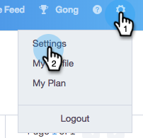
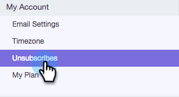
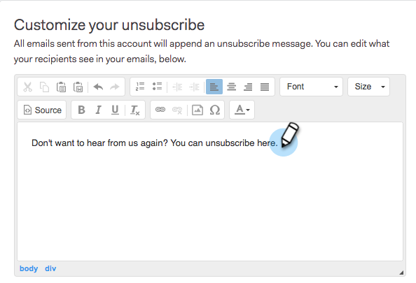
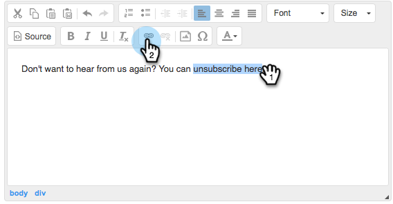
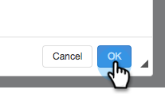
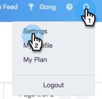
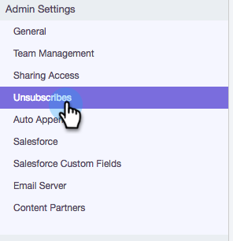
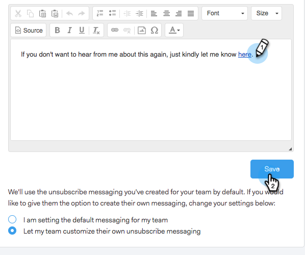
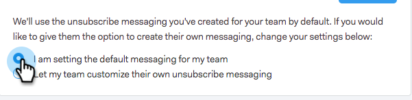

# 購読解除リンクメッセージのカスタマイズ {#customize-unsubscribe-link-message}

これまでもチームごとに購読解除リンクのメッセージをカスタマイズできましたが、管理者がチーム全体の購読解除リンクメッセージを設定して、メッセージに一貫性をもたせることができるようになりました。

>[!NOTE]
>
>[!DNL Sales Connect] ではサードパーティの登録解除リンクは使用できません。この情報は、アドビのデータベースに取り込まれないからです。

## 自分用のメッセージ設定をカスタマイズする {#customize-messaging-for-yourself}

1. [web アプリケーション](https://toutapp.com/login)にログインします。右上の歯車アイコンをクリックして、「**[!UICONTROL 設定]**」を選択します。

   

1. 「[!UICONTROL マイアカウント]」で、「**[!UICONTROL 登録解除]**」を選択します。

   

1. テキストボックスにカスタムメッセージを書き出します。

   

1. 購読解除ページに移動する際にユーザがクリックするテキストをハイライト表示してから、リンクアイコンをクリックします。

   

   >[!NOTE]
   >
   >ハイパーリンクされている URL は関係ありません。 メールが送信されると、そのハイパーリンクは当社の購読解除リンクに変換されます。

1. 「**[!UICONTROL OK]**」をクリックします。

   

## チームの購読解除メッセージを設定する {#set-unsubscribe-messaging-for-your-team}

1. [web アプリケーション](https://toutapp.com/login)にログインします。右上の歯車アイコンをクリックして、「**[!UICONTROL 設定]**」を選択します。

   

1. 「[!UICONTROL 管理者設定]」で、「**[!UICONTROL 登録解除]**」を選択します。

   

1. メッセージをカスタマイズし、完了したら、「**[!UICONTROL 保存]**」をクリックします。

   

1. 「**[!UICONTROL グループにデフォルトのメッセージを設定する]**」を選択して、すべてのユーザーにメッセージを適用します。

   
