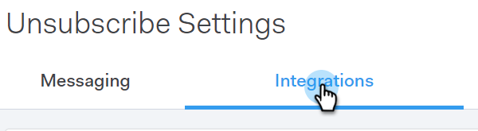
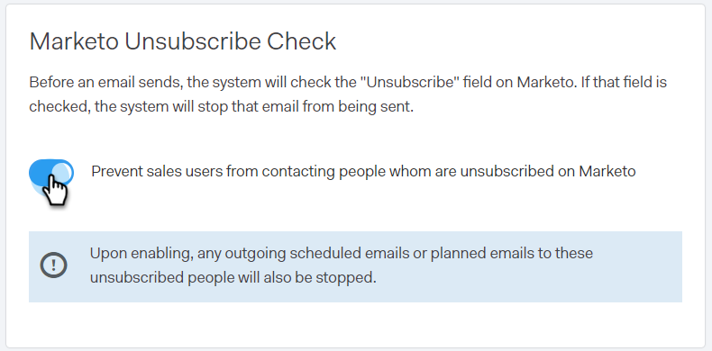

# Marketo 配信停止チェック {#marketo-unsubscribe-check}

[!UICONTROL Marketo 登録解除チェック]は、チームの Marketo への接続を使用して、Marketo のリード管理システムで登録解除になっているユーザにメールが送信されるのを防ぎます。セールスユーザが [!DNL Sales Connect] を使用してメールを送信すると、Marketo に対する API 呼び出しが実行され、そのメール ID が登録解除されているかどうかを確認します。配信停止の場合、メール送信がブロックされます。

>[!NOTE]
>
>**管理者権限が必要**

## オンにする {#turning-it-on}

1. Web アプリケーションで、歯車アイコンをクリックし、「**[!UICONTROL 設定]**」を選択します。

   

1. 「[!UICONTROL 管理者設定]」で、「**[!UICONTROL 登録解除]**」をクリックします。

   

1. 「**[!UICONTROL 統合]**」をクリックします。

   

1. 「[!UICONTROL Marketo 登録解除チェック]」セクションで、スライダーをクリックしてチェックを有効にします。

   

## 留意事項 {#things-to-know}

Marketo 配信停止チェックの留意事項は次のとおりです。

* API の制限に対してはカウントしません
* Marketo 接続が確立されている必要があります
* グローバル設定です
* Web アプリケーション、メールクライアント、Salesforce から送信されるメールをブロックします
* 失敗したメールをログに記録するか、ユーザーがすべてのワークフロー（メールプラグイン送信、個別送信、販売キャンペーン送信、複数選択および送信）で送信しようとすると、送信を阻止します。[グループメール](/help/marketo/product-docs/marketo-sales-connect/email/using-the-compose-window/composing-bulk-emails-with-select-and-send.md)の場合は、メールの送信を静かに阻止します
