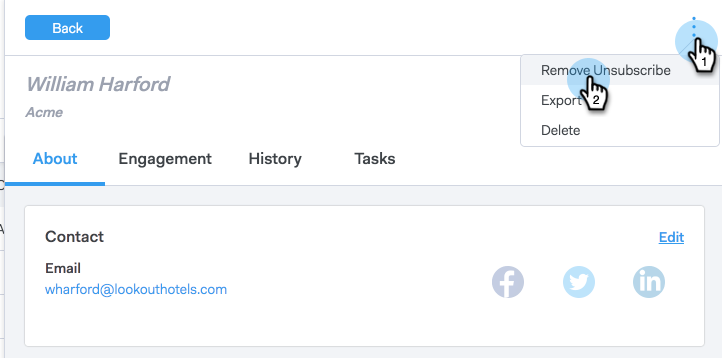

# 登録解除{#resubscribing-an-unsubscribe}

電子メールの受信をオプトバックしたい場合があります。 次に、購読を取り消したメールを再びメール可能にする方法を示します。

>[!NOTE]
>
>**必要な管理者権限**

>[!CAUTION]
>
>再登録する前に、再登録の承認がドキュメント化され、適用されるすべての法律に準拠していることを示す必要があります。

>[!NOTE]
>
>登録解除の同期を有効にしている場合、ToutAppから登録解除を削除し、Salesforceでチェックマークを外して、個人レコードが再び同期されないようにする必要がありオプトアウトます。

1. [Webアプリケーション](http://toutapp.com/login)に移動し、**ユーザー**&#x200B;をクリックします。
1. 個人の詳細表示を開く個人を選択します。

   

1. 人物の詳細表示の3つのドットをクリックし、「**登録解除**」を選択します。

   

1. ユーザーが電子メールの受信をオプトインし直す理由を選択し、「**登録解除**」をクリックします。

   

