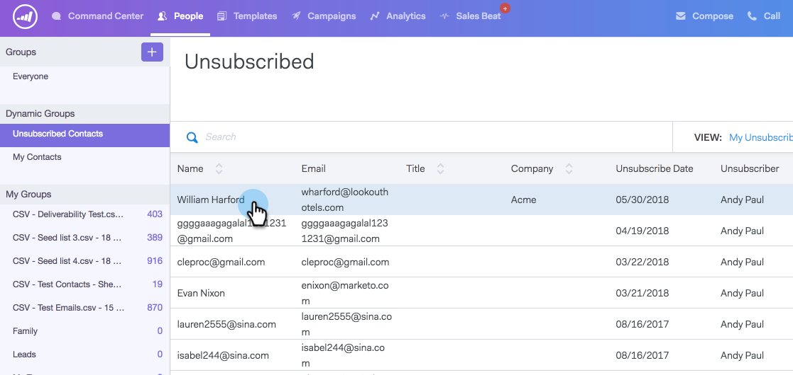
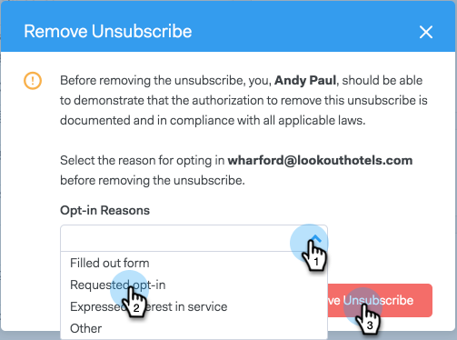

# [!UICONTROL 登録解除]の再登録 {#resubscribing-an-unsubscribe}

メール受信に再びオプトインしたい場合があります。 ここでは、登録解除したメールを再びメール可能にする方法を示します。

>[!NOTE]
>
>**管理者権限が必要**

>[!CAUTION]
>
>再登録する前に、再登録の承認がドキュメント化され、適用されるすべての法律に準拠していることを示す必要があります。

>[!NOTE]
>
>登録解除の同期をオンにしている場合、ToutApp から登録解除を削除し、ユーザレコードが再び同期しないように [!DNL Salesforce] でオプトアウトをオフにする必要があります。

1. [web アプリケーション](https://toutapp.com/login)に移動して、「**[!UICONTROL ユーザー]**」をクリックします。

1. 詳細表示を開くユーザーを選択します。

   

1. ユーザーの詳細表示の 3 つの点をクリックし、「**[!UICONTROL 登録解除を削除]**」を選択します。

   

1. メール受信に再登録する理由を選択し、「**[!UICONTROL 登録解除を削除]**」をクリックします。

   

>[!NOTE]
>
>登録解除同期をオンにしている場合、Salesforce のレコードのオプトアウトボックスもオフにする必要があります。オフにしないと、夜間同期で、そのユーザが [!DNL Salesforce] でオプトアウトされていることが検出され、[!DNL Sales Connect] でそのユーザの登録が解除されます。 いずれかのレコードがオプトアウト／登録解除された場合、同期により、リンクされたレコードがそのようにマークされます。
