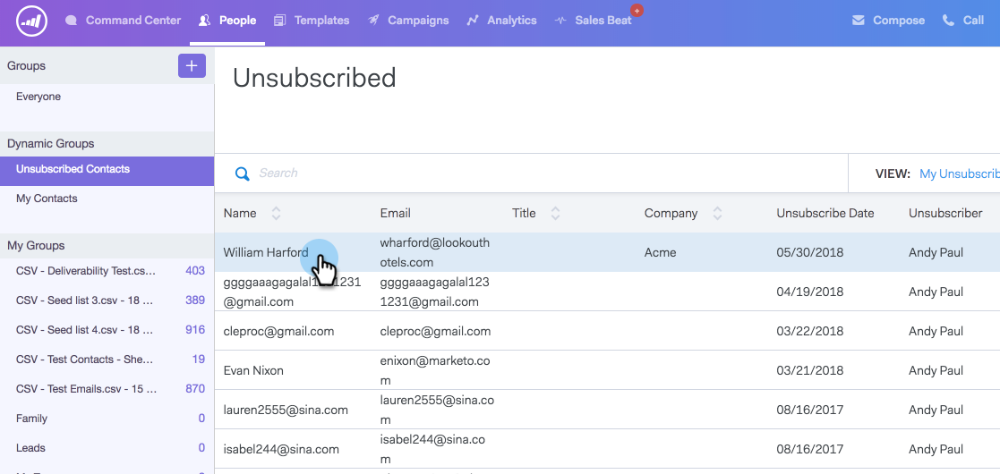
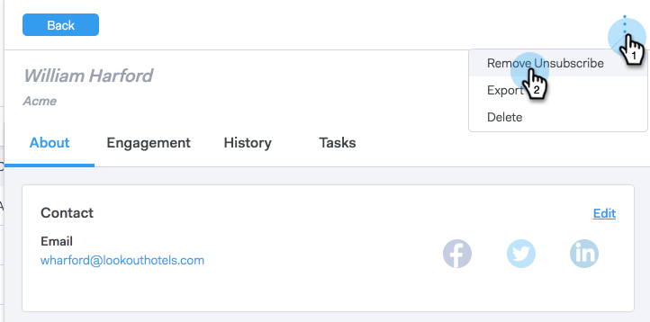
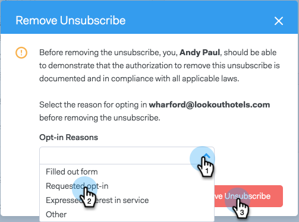

# [!UICONTROL 登録解除]の再登録 {#resubscribing-an-unsubscribe}

メール受信に再びオプトインしたい場合があります。 ここでは、購読解除した相手に再びメールを送信できるようにする方法を説明します。

>[!NOTE]
>
>**管理者権限が必要**

>[!CAUTION]
>
>再登録する前に、再登録の承認がドキュメント化され、適用されるすべての法律に準拠していることを示す必要があります。

>[!NOTE]
>
>登録解除の同期をオンにしている場合、ToutApp から登録解除を削除し、ユーザレコードが再び同期しないように [!DNL Salesforce] でオプトアウトをオフにする必要があります。

1. [web アプリケーション](https://toutapp.com/login)に移動して、「**[!UICONTROL ユーザー]**」をクリックします。

1. 人物を選択して、その人物の詳細ビューを開きます。

   

1. ユーザーの詳細表示の 3 つの点をクリックし、「**[!UICONTROL 登録解除を削除]**」を選択します。

   

1. メール受信に再登録する理由を選択し、「**[!UICONTROL 登録解除を削除]**」をクリックします。

   

>[!NOTE]
>
>登録解除同期をオンにしている場合、Salesforce のレコードのオプトアウトボックスもオフにする必要があります。オフにしないと、夜間同期で、そのユーザが [!DNL Salesforce] でオプトアウトされていることが検出され、[!DNL Sales Connect] でそのユーザの登録が解除されます。 いずれかのレコードがオプトアウト／購読解除になっている場合、同期によりリンクされたレコードも同様にマークされます。
