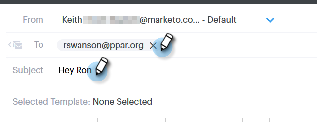

# メールへの添付ファイルまたはトラック可能コンテンツの追加 {#add-an-attachment-or-trackable-content-to-your-email}

[!DNL Sales Connect] 経由でメールを送信する場合、ファイルを添付ファイルとして追加するか、ファイルをダウンロード可能な（トラッキング可能な）リンクにするオプションがあります。

>[!NOTE]
>
>通常、20 MB を超えるファイルは大きすぎて配信できません。メールで送信できる添付ファイルのサイズは、使用しているメール配信チャネルによって異なります。

## 添付ファイルの追加 {#add-an-attachment}

1. メールの下書きを作成します（複数の方法があります。この例では、ヘッダーの「**[!UICONTROL 作成]**」を選択しています）。

   

1. 「[!UICONTROL  宛先 ]」フィールドに入力し、「件名 [!UICONTROL  を入力 ] ます。

   

1. 歯車アイコンをクリックします。

   

1. 添付するファイルを選択し、「**[!UICONTROL 挿入]**」をクリックします。

   

   >[!NOTE]
   >
   >ファイルをアップロードする必要がある場合は、ウィンドウの右上の「**コンテンツをアップロード**」ボタンをクリックします。

   

添付ファイルがメールの下部に表示されます。

## トラック可能コンテンツを追加 {#add-trackable-content}

1. メールドラフトを作成します（これを行う方法は複数あります。この例では、「[!UICONTROL  作成 ]」ウィンドウを選択しています）。

   

1. 「[!UICONTROL  宛先 ]」フィールドに入力し、「件名 [!UICONTROL  を入力 ] ます。

   

1. トラック可能コンテンツを表示するメール内のスポットをクリックし、添付アイコンをクリックします。

   

1. 追加するコンテンツを選択し、「**[!UICONTROL コンテンツは追跡されています]**」スライダーをクリックして、「**[!UICONTROL 挿入]**」をクリックします。

   

   >[!NOTE]
   >
   >ファイルをアップロードする必要がある場合は、ウィンドウの右上の「**コンテンツをアップロード**」ボタンをクリックします。

   コンテンツはメール内にリンクとして表示されます。受信者は、このリンクをクリックしてコンテンツをダウンロードできます。

   

   >[!NOTE]
   >
   >トラックされたコンテンツが閲覧されると、ライブフィードに通知が表示されます。また、最もパフォーマンスの高いコンテンツを Analytics ページのコンテンツセクションに表示することもできます。
