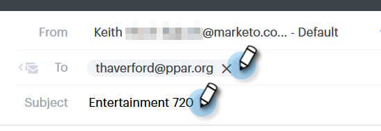
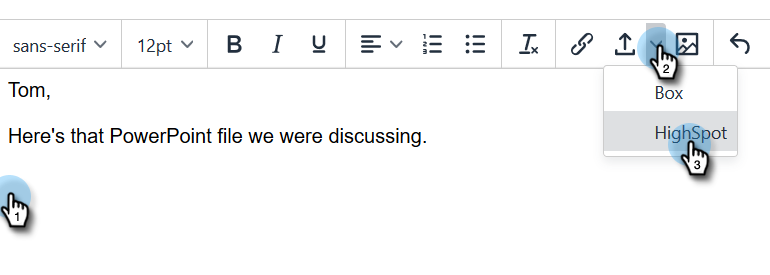
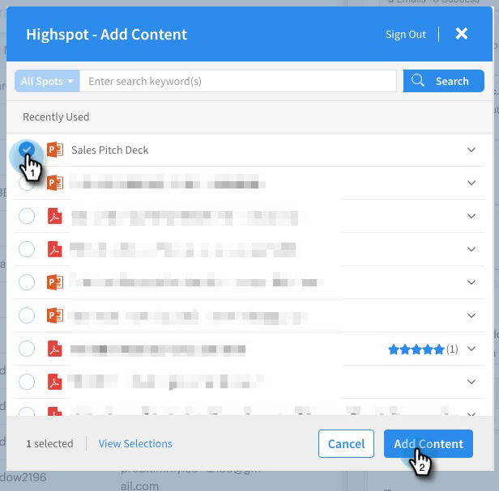

# メールへの [!DNL Highspot] コンテンツの追加 {#adding-highspot-content-to-your-email}

[!DNL Highspot]のお客様の場合は、[!DNL Highspot]のコンテンツを[!DNL Sales Connect]の電子メールに簡単に挿入できます。

1. メールの下書きを作成します（複数の方法があります。この例では、ヘッダーの「**[!UICONTROL 作成]**」を選択しています）。

   

1. 「[!UICONTROL 宛先]」フィールドに入力し、「[!UICONTROL 件名]」を入力します。

   

1. [!DNL Highspot] コンテンツを挿入するメール内の場所をクリックします。 （添付ファイルアイコンの横にある）矢印ドロップダウンをクリックし、「**[!UICONTROL Highspot]**」を選択します。

   

1. [!DNL Highspot] アカウントにログインします。

   

1. 目的のコンテンツを選択し、「**[!UICONTROL コンテンツを追加]**」ボタンをクリックします。

   

   >[!NOTE]
   >
   >表示するコンテンツが表示されない場合は、上部の検索バーを使用します。

   

コンテンツはメール内にリンクとして表示されます。 受信者は、このリンクをクリックして、コンテンツを表示またはダウンロードできます。
