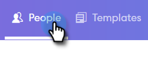
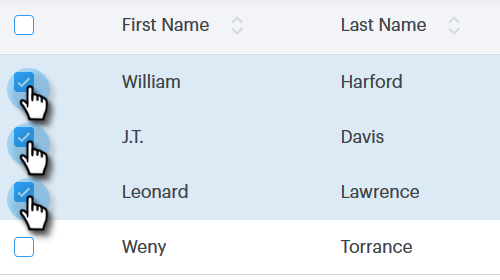

# 選択と送信を使用したバルク電子メールの構成 {#composing-bulk-emails-with-select-and-send}

「選択して送信」オプションを使用して電子メールを送信/編集する方法を次に示します。

## 電子メールの送信 {#sending-emails}

1. 「ユーザー」ページに移動します。

   

1. 電子メールを送信するユーザーを選択します。

   

   >[!NOTE]
   >
   >「選択して送信」を使用する場合は、最大200人まで選択できます。

1. 「選択した **電子メール** 」ボタンをクリックします。

   

1. 件名を入力し、テンプレートを選択し（またはゼロから電子メールを作成）、電子メールを送信/ スケジュールします。

   

   >[!NOTE]
   >
   >テンプレートを選択し、送信前にすべての動的フィールドに正しく値が埋め込まれていることを確認する場合は、[ **プレビュー動的フィールド**]をクリックします。 バルクサイドバーのすべての受信者が、すべての電子メールのプレビューに対して選択されていることを確認します。 1つの電子メールを選択し、「 **プレビュー動的フィールド**」をクリックすると、その電子メールのみがプレビューされます。

## 電子メールの編集 {#editing-emails}

**バルク編集**

1. 「電子メールの [送信」セクションの手順1](http://docs.marketo.com/display/DOCS/Composing+Bulk+Emails+with+Select+and+Send#ComposingBulkEmailswithSelectandSend-SendingEmails)～3に従います。

   >[!NOTE]
   >
   >すべての受信者がデフォルトで選択されます。 個人をクリックして全員を再選択する場合は、「 **すべての受信者**」をクリックします。 バルク編集を行うには、すべての受信者を選択する必要があります。

1. エディターで変更を行います。 新しい電子メールを作成したり、テンプレートを編集したりできます（この例では、新しい電子メールを作成しています）。

   

   >[!NOTE]
   >
   >特定の電子メール受信者をクリックして、その電子メールに反映された変更を確認できます。

1. 「 **送信** 」(または「 [スケジュール](http://docs.marketo.com/x/GAQ6Ag)」)をクリックして、すべての受信者に送信し、一括電子メールの更新を行います。

   

**各電子メールの編集**

バルク更新を実行して各電子メールをカスタマイズする前に、バルク構成サイドバーにあるすべての電子メールに対する変更を一括更新で上書きするので、一括更新を完了してください。

1. 「電子メールの [送信」セクションの手順1 ～ 4に従います。](http://docs.marketo.com/display/DOCS/Composing+Bulk+Emails+with+Select+and+Send#ComposingBulkEmailswithSelectandSend-SendingEmails)

   >[!NOTE]
   >
   >すべての受信者がデフォルトで選択されます。 個人をクリックして全員を再選択する場合は、「 **すべての受信者**」をクリックします。 バルク編集を行うには、すべての受信者を選択する必要があります。

1. 個々の受信者を選択します。

   

1. エディターで変更を行います。

   

   >[!NOTE]
   >
   >ここで、残りの電子メールを更新せずに、バルクサイドバーの単一の電子メールに編集を加えることができます。

   >[!TIP]
   >
   >他の受信者をクリックすると、前に選択した受信者に対して行った変更が表示されていないことを確認できます。

1. 「 **送信** 」(または「 [スケジュール](http://docs.marketo.com/x/GAQ6Ag)」)をクリックして、すべての受信者に送信し、一括電子メールの更新を行います。

   

   >[!NOTE]
   >
   >**関連記事**
   >
   >    
   >    
   >    * [バルク送信オプション](http://docs.marketo.com/x/HwQ6Ag)
   >    * [「構成」ウィンドウでのテンプレートの使用](http://docs.marketo.com/x/MQQ6Ag)
   >    * [動的フィールド](http://docs.marketo.com/x/wwDb)

