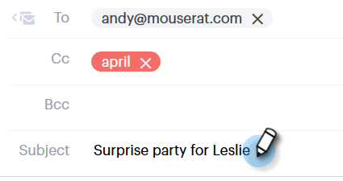

# 追跡する電子メールの送信 {#sending-a-tracked-email}

Marketto Sales Connectと共に電子メールを送信すると、表示（電子メールが開く）とクリック（クリックされたリンク）が追跡されます。

>[!NOTE]
>
>**前提条件**
>
>追跡する電子メールを送信する前に、IDの検証と電子メール配信チャネルの設定を行う必要があります。
>
>* [電子メールアドレスの確認](http://docs.marketo.com/x/ewPh)
>* [Outlook](http://docs.marketo.com/x/Z4AOAQ) または [Gmailの配信チャネルを設定する](http://docs.marketo.com/x/kYMOAQ)

>

1. 電子メールの下書きを作成します(複数の方法があります。この例では、ヘッダーで **構成** )。

   

1. [宛先 **** ]フィールドに受信者の名前または電子メールを入力します。

   

   >[!NOTE]
   >
   >[宛先]フィールドには1人のユーザーしか入力できません。

1. 各フィ追加ールドの[CC]または[BCC]に希望する受信者。

   

   >[!NOTE]
   >
   >CCまたはBCCである人が電子メールを開くと、その電子メールは[宛先 **** ]フィールドに表示として記録されます。

1. 件名追加です。

   

   >[!NOTE]
   >
   >電子メールの送信には件名と受信者が必要です。 件名行と受信者が追加され **ると** 、下書きが自動的に保存されます。

1. エディターを使用して電子メールを作成します。 完了したら、 **「送信** 」(または希望する [場合は「スケジュール](http://docs.marketo.com/x/GAQ6Ag)」)をクリックします。

   

   >[!NOTE]
   >
   >**関連記事**
   >
   >    
   >    
   >    * [電子メールのスケジュール](http://docs.marketo.com/x/GAQ6Ag)
   >    * [動的フィールド](http://docs.marketo.com/x/wwDb)
   >    * [テンプレートの使用](http://docs.marketo.com/display/DOCS/Templates)

