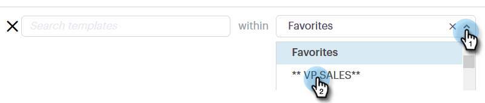
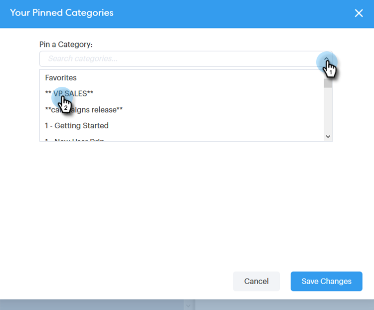

# 「構成」ウィンドウでのテンプレートの使用 {#using-a-template-in-the-compose-window}

## テンプレートの検索と使用 {#finding-and-using-templates}

1. 電子メールの下書きを作成します(複数の方法があります。この例では、ヘッダーで **構成** )。

   

1. 「宛先」フィールドに入力します。

   

1. テンプレートセクションの検索アイコンをクリックして、テンプレート検索フィールドを開きます。

   

1. 検索するカテゴリを選択します(すべてのカテゴリを検索する場合は「すべて」を選択します)。

   

1. テンプレート名、件名、または電子メールの本文で検索します。 目的のテンプレートをクリックして選択します。

   

   >[!NOTE]
   >
   >別のテンプレートを選択すると、現在エディターにあるすべての情報が置き換えられます。 変更を加えた場合は、別のテンプレートを選択する前に、必ず変更をコピーしてください。

## 作成ウィンドウでのテンプレートカテゴリの固定 {#pinning-template-categories-in-the-compose-window}

最 **大5つのテンプレートカテゴリをお気に入りに登録すると** 、よく使用するテンプレートにすばやくアクセスできます。

1. 電子メールの下書きを作成します(複数の方法があります。この例では、ヘッダーで **構成** )。

   

1. 「お気に入り」の横にある **+** アイコンをクリックします。

   

1. 「 **カテゴリの** 固定」ドロップダウンをクリックし、目的のカテゴリを選択します。

   

1. 完了したら、「 **変更の保存** 」をクリックします(オプション：手順3を繰り返して追加します)。

   

   >[!TIP]
   >
   >変更を保存する前にドラッグ&amp;ドロップするだけで、固定したカテゴリの配置を変更できます。

   

   >[!NOTE]
   >
   >**お気に入り** (Favorites)はデフォルトで存在します。 カテゴリではなく、お気に入りの電子メールテンプレートが含まれます。

   >[!NOTE]
   >
   >**関連記事**
   >
   >    
   >    
   >    * [動的フィールド](http://docs.marketo.com/x/wwDb)
   >    * [テンプレートの使用](http://docs.marketo.com/display/DOCS/Templates)

選択したカテゴリがピン留めされました。