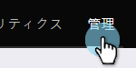

# 新しい Sales Connect インスタンスへのアクセス {#accessing-your-new-sales-connect-instance}

>[!NOTE]
>
>**管理者権限が必要。**

Sales Connect を購入すると、Marketo インスタンスに新しい統合ページが表示されます。このページを使用して、最初のユーザーを招待し、Sales Connect インスタンスをプロビジョニングします。

1. Marketo で、「**管理者**」をクリックします。

   

1. 「**Sales Connect**」をクリックします。

   

1. Marketo 管理者のリストから選択し、「**招待を送信**」をクリックして招待します。

   

Sales Connect アカウントにアクセスする手順が記載されたメールがユーザーに送信されます。

>[!NOTE]
>
>追加のユーザーは、Marketo からは&#x200B;**追加されず**、代わりに Sales Connect のユーザー管理ページから追加されます。ユーザーの追加について詳しくは、[こちらをクリック](/help/marketo/product-docs/marketo-sales-connect/admin/invite-users.md)してください。
