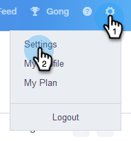
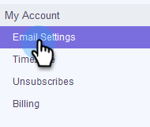
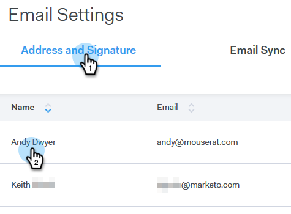
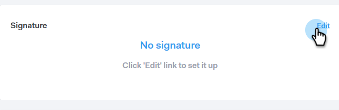
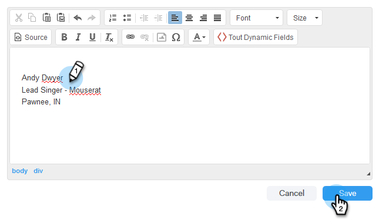

# 電子メール署名の追加 {#add-your-email-signature}

セールスコネクトからメールを送信する際も、自分のメールクライアントから送信しているときと同じようにシームレスなエクスペリエンスになるようにしたいと考えています。 これを行う最も良い方法は、電子メールの署名を追加することです。

1. 歯車アイコンをクリックし、「**[!UICONTROL 設定]**」を選択します。

   

1. [!UICONTROL マイアカウント]で、「**[!UICONTROL メール設定]**」を選択します。

   

1. 「**[!UICONTROL アドレスと署名]**」をクリックし、署名を作成するメール ID を選択します。

   

1. [!UICONTROL 署名]カードで、「**[!UICONTROL 編集]**」をクリックします。

   

1. 目的のテキスト（または画像）を入力し、「**[!UICONTROL 保存]**」をクリックします。

   

   >[!TIP]
   >
   >作成画面の署名が、メールクライアントに表示されている署名と同様になっていることを確認します。
