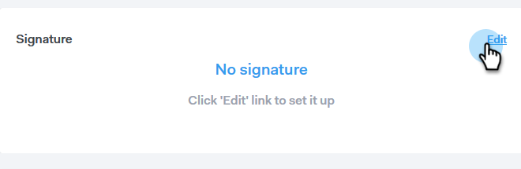

# 追加電子メール署名 {#add-your-email-signature}

Sales Connectからメールを送信する際、お客様のメールクライアントから送信する際に、シームレスな操作を感じることをお勧めします。 これを行う最良の方法は、電子メールの署名を追加することです。

1. 歯車アイコンをクリックし、「 **設定**」を選択します。

   

1. 「マイアカウント」で、「 **電子メール設定**」を選択します。

   

1. 「 **アドレスと署名** 」をクリックし、署名を作成する電子メールIDを選択します。

   

1. Signatureカードで、「 **編集**」をクリックします。

   

1. 必要なテキスト（または画像）を入力し、「 **保存**」をクリックします。

   

   >[!TIP]
   >
   >構成画面の署名が、電子メールクライアントに表示されている署名と似ていることを確認します。
