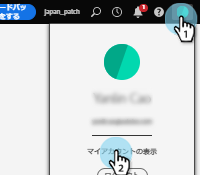
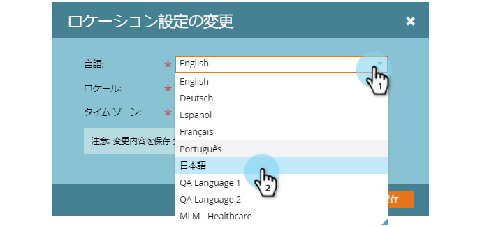
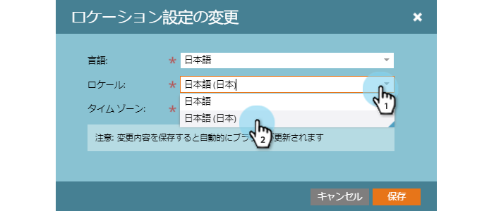

# プロファイルの管理{#manage-your-profile}

マイプロファイルページで、名前、アカウントの言語、ロケール、タイムゾーンを更新し、パスワードを変更することができます。

## アカウンの詳細 {#account-details}

ここで、名前やパスワードを更新できます。

1. 歯車アイコンをクリックし、**設定**&#x200B;を選択します。

   

1. デフォルトでマイプロファイルページが開きます。 名前を更新するには、変更内容を入力し、「**保存**」をクリックします。

   

>[!NOTE]
>
>電子メールアドレスは表示専用に設定されています。 変更が必要な場合は、[Marketoサポート](https://nation.marketo.com/t5/Support/ct-p/Support)にお問い合わせください。

この節では、パスワードを変更することもできます。 手順の概要はこのドキュメントで説明します。

## 統合 {#your-integrations}

ページの右側の「統合」セクションに、アカウントのすべての接続のステータスが表示されます。

>[!NOTE]
>
>Exchange On PremをSales Connectと共に使用している場合、配信チャネル（最初の行項目）または返信追跡（2番目の行項目）統合のヘルスチェックは更新されません。 アドビは、今後のリリースでこの機能をサポートするよう取り組んでいます。

## タイム ゾーン {#time-zone}

アカウントの言語、ロケール、タイムゾーンの変更方法を以下に示します。

>[!NOTE]
>
>サポートされている言語：英語、フランス語、ドイツ語、日本語、ポルトガル語、スペイン語。

1. 歯車アイコンをクリックし、**設定**&#x200B;を選択します。

   

1. 言語を変更するには、**言語**&#x200B;ドロップダウンをクリックし、選択を行います。

   

1. ロケールは、その言語が話されている地域を指します。 「**ロケール**」ドロップダウンをクリックして選択します。

   

1. 「**タイムゾーン**」ドロップダウンをクリックして選択します。

   

1. 終了したら「**保存**」をクリックします。

   

ボイラ！
