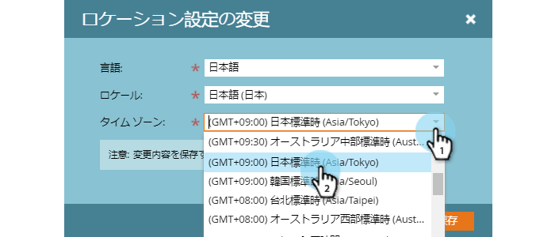

# プロファイルの管理 {#manage-your-profile}

[!UICONTROL &#x200B; マイプロファイル &#x200B;] ページでは、名前、アカウントの言語/ロケール/タイムゾーンを更新し、パスワードも変更できます。

## アカウントの詳細 {#account-details}

ここで、名前やパスワードを更新できます。

1. 歯車アイコンをクリックし、「**[!UICONTROL 設定]**」を選択します。

   

1. デフォルトでマイプロファイルページが開きます。名前を更新するには、変更内容を入力し、「**[!UICONTROL 保存]**」をクリックします。

   

>[!NOTE]
>
>メールアドレスは表示専用に設定されています。変更が必要な場合は、[Marketo サポート](https://nation.marketo.com/t5/Support/ct-p/Support)にお問い合わせください。

このセクションでは、パスワードを変更することもできます。手順の概要はこのドキュメントで説明します。

## 連携 {#your-integrations}

ページの右側の「[!UICONTROL &#x200B; 統合 &#x200B;]」セクションには、アカウントのすべての接続のステータスが表示されます。

>[!NOTE]
>
>Exchange オンプレミスを Sales Connect と共に使用している場合、配信チャネル（最初の行項目）または返信トラッキング（2 番目の行項目）連携のヘルスチェックは更新されません。アドビは、今後のリリースでこの機能をサポートするように取り組んでいます。

## タイムゾーン {#time-zone}

アカウントの言語、ロケール、タイムゾーンの変更方法を以下に示します。

>[!NOTE]
>
>サポートされている言語：英語、フランス語、ドイツ語、日本語、ポルトガル語、スペイン語。

1. 歯車アイコンをクリックし、「**[!UICONTROL 設定]**」を選択します。

   

1. 言語を変更するには、「**[!UICONTROL 言語]**」ドロップダウンをクリックして選択します。

   

1. ロケールは、その言語が話されている地域を指します。「**[!UICONTROL ロケール]**」ドロップダウンをクリックして選択します。

   

1. 「**[!UICONTROL タイムゾーン]**」ドロップダウンをクリックして選択します。

   

1. 終了したら「**[!UICONTROL 保存]**」をクリックします。

   

これで完了です。
