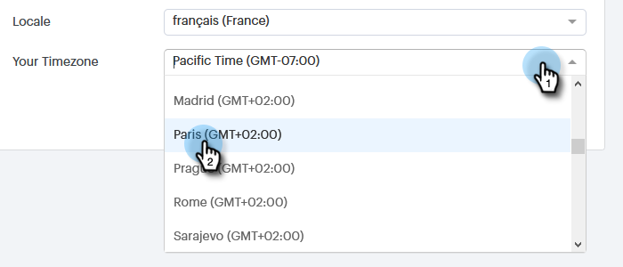

# マイプロファイルページ{#my-profile-page}

[マイプロファイル]ページでは、名前、アカウントの言語、ロケール、タイムゾーンを更新したり、パスワードを変更したりできます。

## アカウントの詳細{#account-details}

ここで、名前やパスワードを更新できます。

1. 歯車アイコンをクリックし、**設定**&#x200B;を選択します。

   

1. デフォルトで[マイプロファイル]ページが開きます。 名前を更新するには、変更を入力し、「**保存**」をクリックします。

   

>[!NOTE]
>
>電子メールアドレスが表示のみに設定されている。 変更が必要な場合は、[マーケティング担当者](https://nation.marketo.com/t5/Support/ct-p/Support)にお問い合わせください。

このセクションでは、パスワードを変更することもできます。 このドキュメントでは、手順の概要を説明します。

## 統合{#your-integrations}

ページの右側の「統合」セクションには、アカウントのすべての接続のステータスが表示されます。

>[!NOTE]
>
>Sales ConnectとExchange On Premを使用している場合、配信チャネル（最初の行項目）または返信追跡（2番目の行項目）統合のヘルスチェックは更新されません。 今後のリリースでサポートする予定です。

## タイムゾーン{#time-zone}

アカウントの言語、ロケール、タイムゾーンを変更する方法を次に示します。

>[!NOTE]
>
>サポートされる言語：英語、フランス語、ドイツ語、日本語、ポルトガル語、スペイン語。

1. 歯車アイコンをクリックし、**設定**&#x200B;を選択します。

   

1. 言語を変更するには、**言語**&#x200B;ドロップダウンをクリックし、選択を行います。

   

1. ここのロケールは、その言語が読み上げられる領域を指します。 「**ロケール**」ドロップダウンをクリックし、選択します。

   

1. 「**タイムゾーン**」ドロップダウンをクリックし、選択します。

   

1. 終了したら「**保存**」をクリックします。

   

ボイラ！
