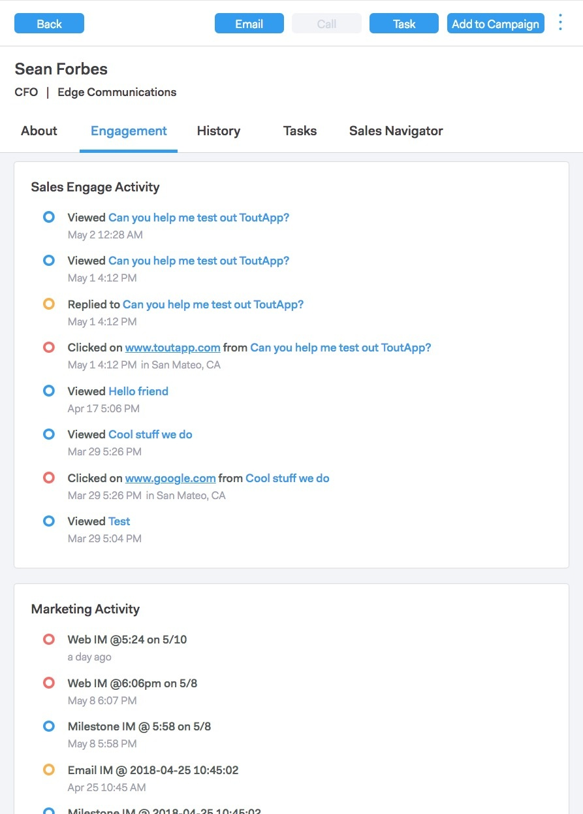
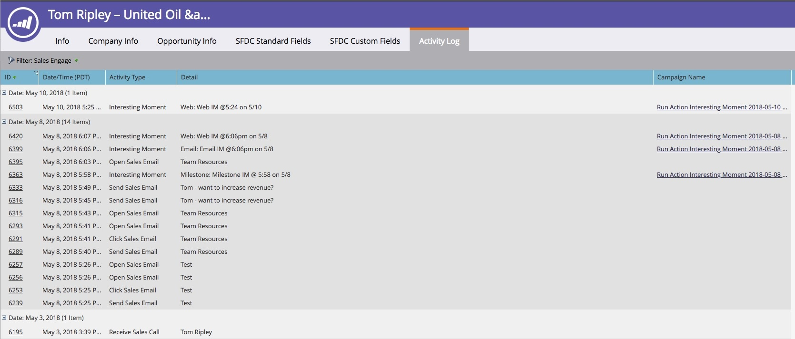
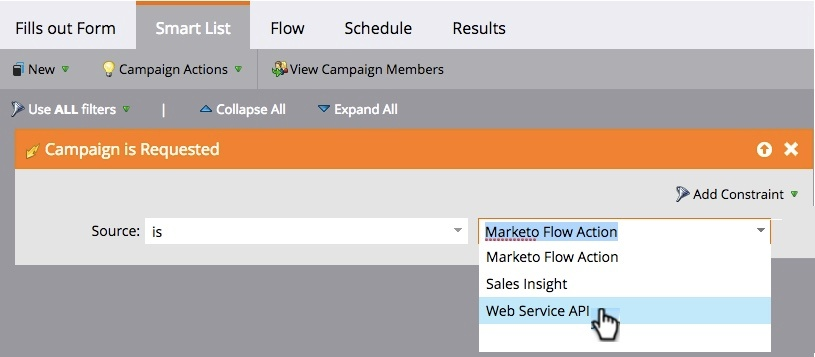

# Sales Connect の概要 {#sales-connect-overview}

Marketo Sales Connect は、様々な機能を備えた多面的なセールスサポートソリューションで、セールスサイクル全体を通じてエンゲージメントを促進します。

>[!AVAILABILITY]
>
>必ずしもすべてのお客様がこの機能を購入済みとは限りません。 詳しくは、アドビのアカウントチーム（アカウントマネージャー）にお問い合わせください。

## ライブフィード {#the-live-feed}

セールス担当者は、マーケティングとセールスの両方のコンテンツの[リアルタイムエンゲージメント](/help/marketo/product-docs/marketo-sales-connect/email/the-live-feed/live-feed-overview.md)を表示できます。

## 人物の詳細表示 {#person-detail-view}

[詳細なリードの統計](/help/marketo/product-docs/marketo-sales-connect/people/person-detail-view.md)にアクセスします。

## Marketo アクティビティログで結果を確認 {#see-results-in-your-marketo-activity-log}

見込み客がセールス活動に対してどのようにエンゲージしているかを確認します。

<table>
 <tbody>
  <tr>
   <th>アクティビティのタイプ</th>
   <th>説明</th>
  </tr>
  <tr>
   <td>
セールスメールを送信
</td>
   <td>
ユーザーがセールスコネクトからセールスメールを送信します。
</td>
  </tr>
  <tr>
   <td>
セールスメール開封
</td>
   <td>
リードがセールスコネクトから送信されたセールスメールを開封します。
</td>
  </tr>
  <tr>
   <td>
セールスメールクリック
</td>
   <td>
リードがセールスコネクトから送信されたセールスメール内のリンクをクリックします。
</td>
  </tr>
  <tr>
   <td colspan="1">
セールスメール受信
</td>
   <td colspan="1">
リードがセールスコネクトから送信されたセールスメールを受信します。
</td>
  </tr>
  <tr>
   <td colspan="1">
セールス電話受信
</td>
   <td colspan="1">
リードが、セールス担当者から<a href="/help/marketo/product-docs/marketo-sales-connect/phone/sales-phone-overview.md" rel="nofollow">セールス電話</a>を使用した電話を受信。
</td>
  </tr>
  <tr>
   <td colspan="1">
セールスキャンペーンに追加
</td>
   <td colspan="1">
Sales Connect（キャンペーンページ）で作成したセールスキャンペーンにリードが追加。
</td>
  </tr>
  <tr>
   <td colspan="1">
セールスキャンペーンから削除
</td>
   <td colspan="1">
リードがセールスキャンペーンから削除されました。
</td>
  </tr>
  <tr>
   <td colspan="1">
注目のアクション
</td>
   <td colspan="1">
リードが Marketo で注目のアクションを起こした。
</td>
  </tr>
 </tbody>
</table>

## マーケティングキャンペーンの共有 {#share-marketing-campaigns}

シンプルなスマートキャンペーンを作成して、セールスユーザに [Marketo キャンペーンデータ](/help/marketo/product-docs/marketo-sales-connect/marketo/make-a-campaign-visible-to-sales-connect-users.md)へのアクセスを許可します。

始める準備は整いましたか？ 設定手順については、以下のリンクをクリックしてください。

>[!MORELIKETHIS]
>
>[Sales Connect 管理者向けスタートガイド](/help/marketo/product-docs/marketo-sales-connect/getting-started/getting-started-guide-for-sales-connect-admins.md)
