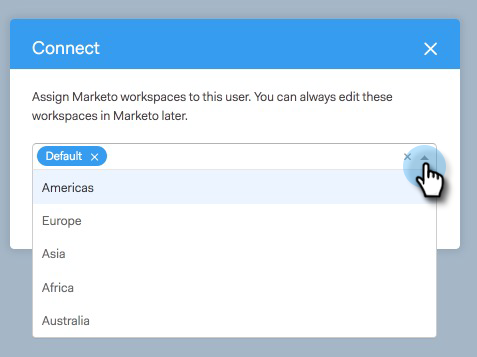

# ユーザーへのアクセス権の付与 {#granting-access-to-users}

この記事の手順に従って、[!DNL Sales Connect] ユーザに Marketo 接続へのアクセス権を付与します。 これにより、ライブフィードの注目のアクションなどの機能が解放され、マーケティングキャンペーンにアクセスできるようになります。

ユーザが（[!DNL Sales Connect] の）Marketo／[!UICONTROL チームアクセス]ページに表示されるには、[こちら](/help/marketo/product-docs/marketo-sales-connect/admin/invite-users.md)でユーザを [!DNL Sales Connect] に招待する必要があります。そこで、Marketo 接続へのアクセス権が付与されます。

>[!CAUTION]
>
>[!DNL Sales Connect] を Marketo に接続し、10 分待ってから、以下の手順を実行してください。

1. 1 人または複数のユーザを選択し、「**[!UICONTROL 接続]**」をクリックします。

   >[!NOTE]
   >
   >ユーザにアクセス権を付与する際に 1 回だけ、ワークスペースの割り当てを実行できます。 設定が完了したら、ユーザーを切断して変更する必要があります。

   

1. Marketo サブスクリプションでワークスペースが有効になっている場合、ワークスペースを各ユーザまたは一連のユーザに一括で割り当てることができます。 ワークスペースが選択されていない場合は、デフォルトの Marketo ワークスペースに割り当てます。

   

1. 「ワークスペース」ドロップダウンをクリックし、目的のワークスペースを選択して、「**[!UICONTROL 接続]**」をクリックします。

   

チーム管理ページから追加のユーザーを追加し、上記の手順に従ってユーザーを接続させることができます。
