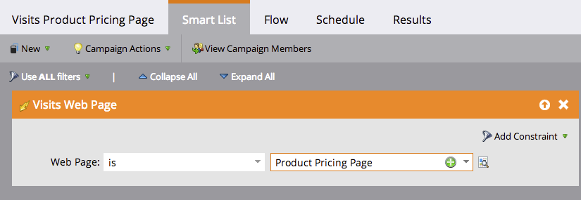
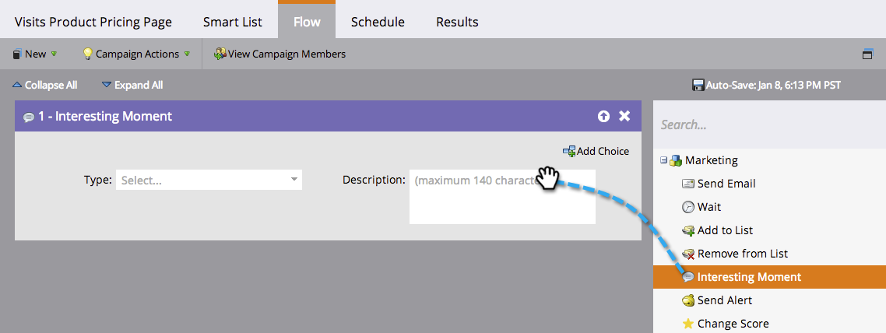
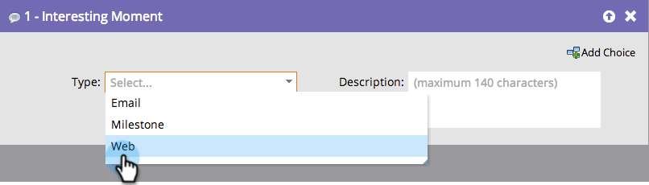
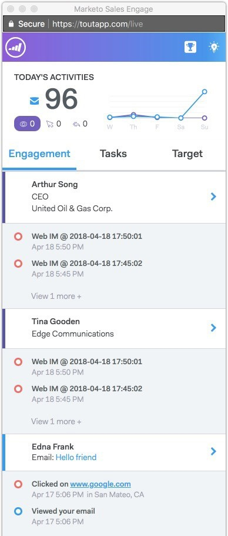

# [!DNL Sales Connect] での注目のアクション {#interesting-moments-in-sales-connect}

注目のアクションは、[!DNL Marketo Sales Connect] を通じてセールスチームとコミュニケーションを取る鍵となります。

>[!AVAILABILITY]
>
>注目のアクションを使用できるのは、[Marketo セールスインサイト](/help/marketo/product-docs/marketo-sales-insight/msi-for-salesforce/features/tabs-in-the-msi-panel/interesting-moments/using-interesting-moments.md)と[!DNL Marketo Sales Connect] を契約されたお客様だけです。

>[!PREREQUISITES]
>
>* [Salesforce CRM への接続](/help/marketo/product-docs/marketo-sales-connect/crm/salesforce-integration/connect-your-sales-connect-account-to-salesforce.md){target="_blank"}が必要です
>* Salesforce のリードまたは取引先責任者の所有者である必要があります
>* [Marketo Engage 接続へのアクセス権を付与](/help/marketo/product-docs/marketo-sales-connect/marketo/granting-access-to-users.md){target="_blank"}するには、アクセス権が必要です

## 注目のアクションとは何でしょうか。 {#what-is-an-interesting-moment}

それは、あなた次第です。 どんな情報がセールスチームに関係あるのかを自分で決定します。 セールスチームがリードについて知りたいのは、例えば次のようなことです。

* 自社 web サイトの価格設定ページを訪問する
* 新製品発表メールに記載されたリンクをクリック
* 製品デモをリクエスト

## 注目のアクションを作成するには {#how-do-i-create-an-interesting-moment}

1. [スマートキャンペーン](/help/marketo/product-docs/core-marketo-concepts/smart-campaigns/understanding-smart-campaigns.md)を選択します。トリガーされた場合にセールスチームが興味を持つものがいいでしょう。

   

1. **[!UICONTROL 注目のアクション]**&#x200B;フローステップをドラッグします。

   

1. **タイプ**&#x200B;を選択します（[!UICONTROL メール]、[!UICONTROL マイルストーン]、[!UICONTROL web]）。

   

1. このアクションが重要である理由として、セールスチームへのメッセージを「**[!UICONTROL 説明]**」フィールドに記入します。

   

   >[!NOTE]
   >
   >Marketo によって、そのアクションが発生した日付と、どのようにして注目のアクションとして追加されたか（例：リードアクション > フローステップ、SOAP API）も追加されます。

## 注目のアクションは、Marketo でどのように表示されるか  {#what-does-an-interesting-moment-look-like-in-marketo}

注目のアクションは、[リードのアクティビティログ](/help/marketo/product-docs/core-marketo-concepts/smart-lists-and-static-lists/managing-people-in-smart-lists/using-the-person-detail-page.md)に表示されます。

## 注目のアクションは、[!DNL Sales Connect] でどのように表示されるか {#what-does-an-interesting-moment-look-like-in-sales-connect}

注目のアクションは、ユーザのライブフィードにリアルタイムで表示されます。 [!DNL Salesforce] のリード所有者 ID を利用して、ユーザが所有する関連リードの注目のアクションを表示します。 リード名の横にあるドロップダウンをクリックすると、メール／電話／セールスキャンペーンでリードを素早くフォローアップできます。

