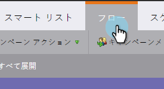
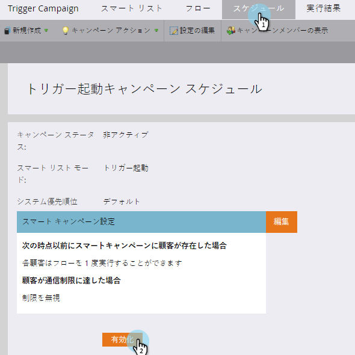

# キャンペーンをSales Connect Usersに表示する {#make-a-campaign-visible-to-sales-connect-users}

キャンペーンは、表示されている場合にのみ共有できます。 その方法を次に示します。

1. 共有するキャンペーンを選択（または作成）します。

   

1. 「 **スマートリスト** 」タブをクリックします。

   

1. キャンペーン追加が要求されたトリガーです。

   

1. ソースには、「is」 **Web Service API**」を選択します。

   

1. 「 **フロー** 」タブをクリックします。

   

1. 「追加注目のモーメント」フローアクション。

   

1. 「タイプ」で、「 **Web**」を選択します。

   

1. 「Description」ボックスに、セールス・チームへのメッセージを書き込みます。 この例では、トークンを使用して、入力されたフォームを指定しています。

   

1. 「 **スケジュール** 」タブをクリックし、 **キャンペーンをアクティブ化します** 。

   

