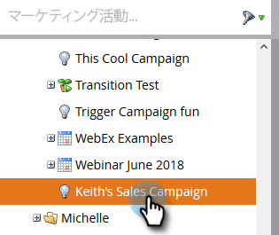
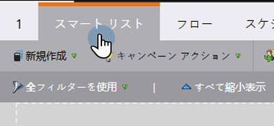
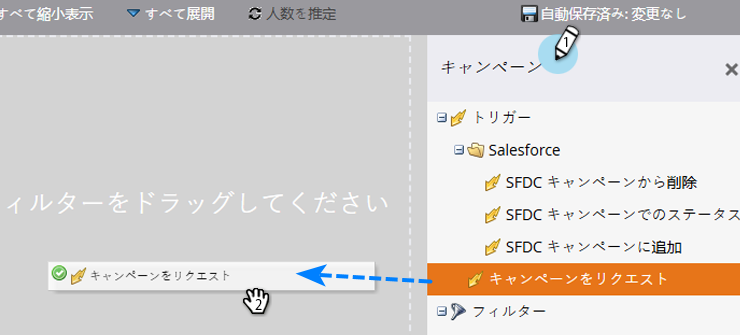
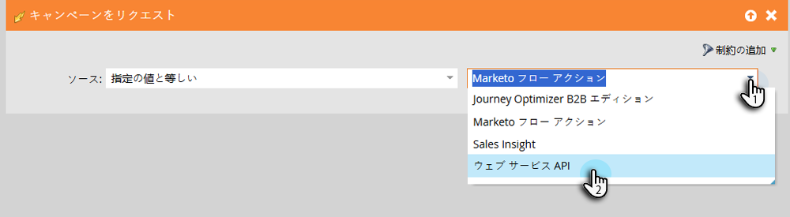
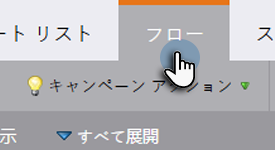
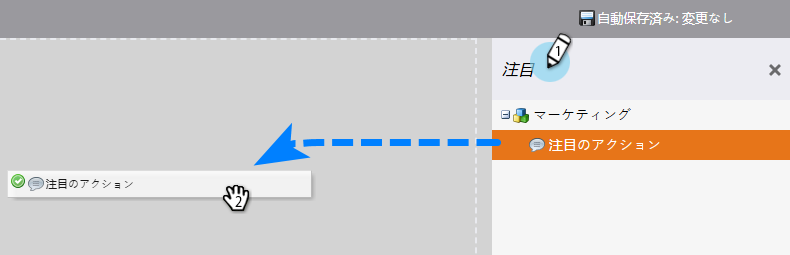
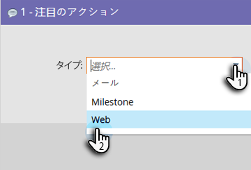
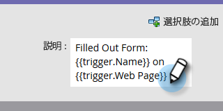
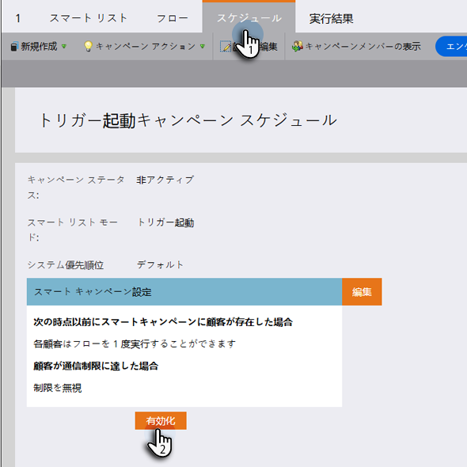

# Sales Connect ユーザーにキャンペーンを表示 {#make-a-campaign-visible-to-sales-connect-users}

キャンペーンは、表示されている場合にのみ共有できます。その方法を説明しましょう。

1. 共有するキャンペーンを選択（または作成）します。

   

1. 「**スマートリスト**」タブをクリックします。

   

1. 「キャンペーンをリクエスト」トリガーに追加します。

   

1. ソースには、「is」「**Web サービス API**」を選択します。

   

1. 「**フロー**」タブをクリックします。

   

1. 注目のアクションフローアクションを追加します。

   

1. タイプには、「**Web**」を選択します。

   

1. 説明ボックスに、セールスチームにメッセージを書き込みます。この例では、トークンを使用して、入力されたフォームを指定します。

   

1. 「**スケジュール**」タブをクリックし、キャンペーンを&#x200B;**アクティベート**&#x200B;します。

   
