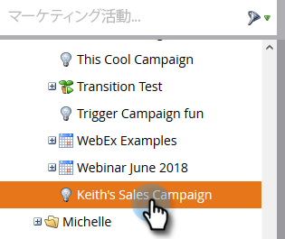
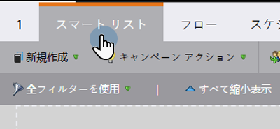
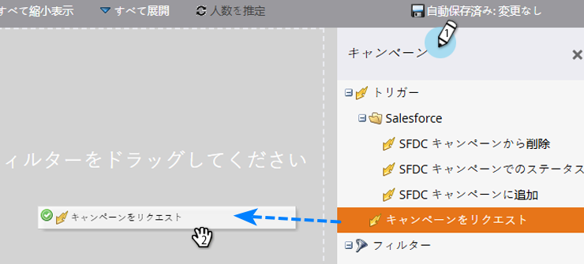
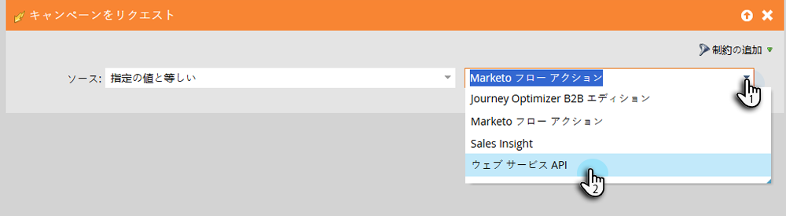
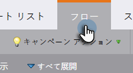
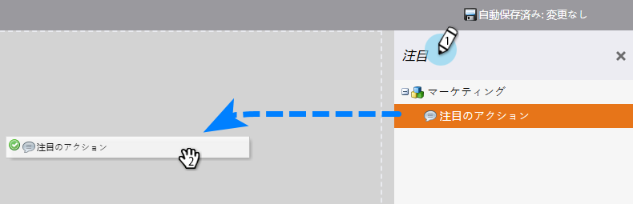
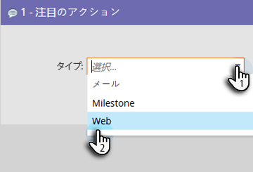
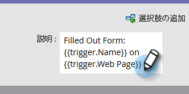
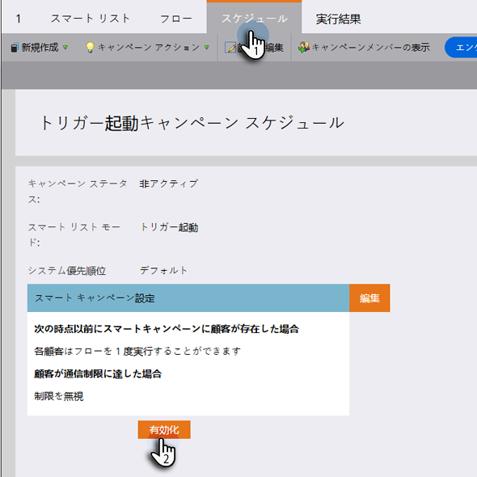

# [!DNL Sales Connect] ユーザにキャンペーンを表示 {#make-a-campaign-visible-to-sales-connect-users}

キャンペーンは、表示されている場合にのみ共有できます。 その方法を説明しましょう。

1. 共有するキャンペーンを選択（または作成）します。

   

1. 「**[!UICONTROL スマートリスト]**」タブをクリックします。

   

1. 「[!UICONTROL キャンペーンをリクエスト]」トリガーに追加します。

   

1. ソースには、「[!UICONTROL is]」「**[!UICONTROL Web サービス API]**」を選択します。

   

1. 「**[!UICONTROL フロー]**」タブをクリックします。

   

1. [!UICONTROL 注目のアクション]フローアクションを追加します。

   

1. [!UICONTROL タイプ]には、「**[!UICONTROL Web]**」を選択します。

   

1. [!UICONTROL 説明]ボックスに、セールスチームにメッセージを書き込みます。 この例では、トークンを使用して、入力されたフォームを指定します。

   

1. 「**[!UICONTROL スケジュール]**」タブをクリックし、キャンペーンを&#x200B;**[!UICONTROL アクティベート]**&#x200B;します。

   
