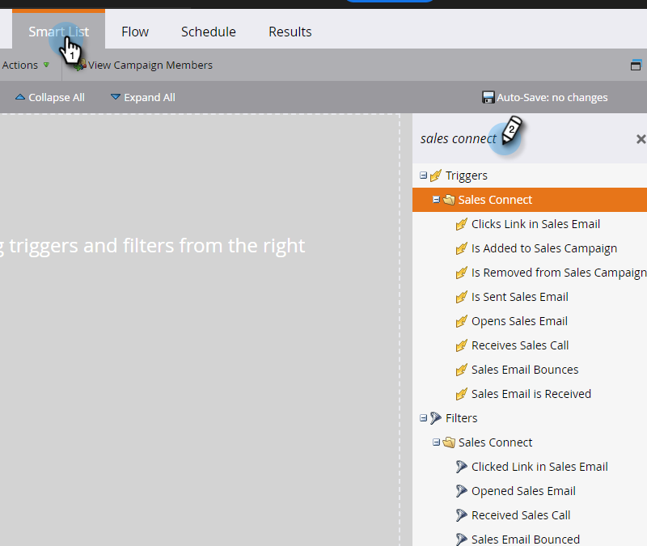

# セールスアクティビティのトリガーとフィルター {#sales-activity-triggers-and-filters}

営業部門とのエンゲージメントをより適切に調整したい場合や、バイヤージャーニー全体を通じて顧客とどのようにエンゲージメントしているのかをより詳細に把握したい場合は、MarketoのSales Activity Insightsが役立ちます。

スマートキャンペーンでセールスアクティビティのフィルターとトリガーを利用する方法を理解する手順は以下のとおりです。

1. 目的のスマートキャンペーンを見つけて選択します。

   

1. 「**[!UICONTROL スマートリスト]**」タブで、「[!UICONTROL セールスアプリ]」を検索します。

   

1. 目的のフィルターまたはトリガーを選択し、ドラッグします。

   

1. 任意の制約を選択します。

   

>[!NOTE]
>
>アクティビティ、制約、定義の完全なリストについては、[セールスアクティビティ用語集](/help/marketo/product-docs/marketo-sales-connect/marketo/sales-activity-glossary.md)を参照してください。
