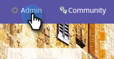
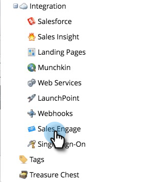
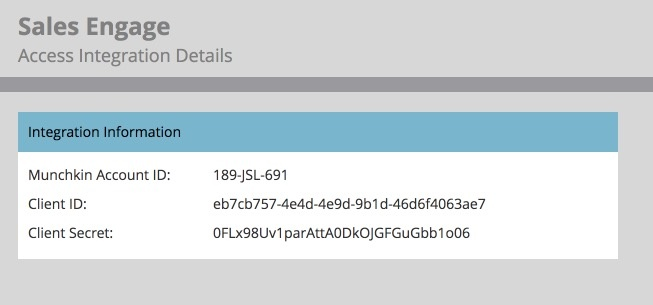
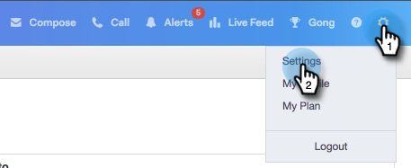
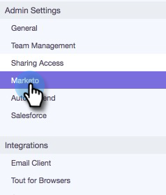
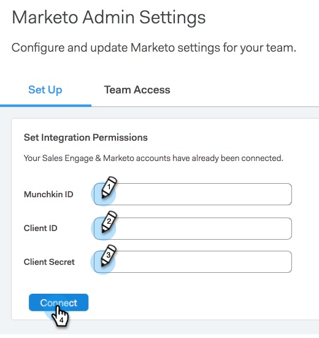

# Marketo 接続の設定 {#set-up-your-marketo-connection}

>[!NOTE]
>
>MSC をプロビジョニングすると、Marketo は自動的に資格情報を [!DNL Sales Connect] に送信し、インスタンスを Marketo に接続します。 この手順は、[!DNL Sales Connect] インスタンスがプロビジョニングされた後に、**接続が確立されていない場合にのみ**&#x200B;必須です。 接続が確立されている場合は、資格情報が Marketo の管理者設定ページに入力されます。

## [!DNL Sales Connect] を Marketo に接続する前の資格情報の取得 {#acquiring-credentials-prior-to-connecting-sales-connect-with-marketo}

Marketo 内から一連の資格情報を取得する必要があります。 これらの資格情報は、後で [!DNL Sales Connect] 管理者が Marketo と [!DNL Sales Connect] を接続する際に使用されます。

1. Marketo で、「**[!UICONTROL 管理者]**」をクリックします。

   

1. ツリーで、「**[!UICONTROL Sales Engage]**」をクリックします。

   

1. [!UICONTROL Munchkin ID]、[!UICONTROL クライアント ID]、[!UICONTROL クライアント秘密鍵]の Marketo 資格情報を選択し、[!DNL Sales Connect] 管理者に送信します。

   

   >[!NOTE]
   >
   >上記の情報をコピー＆ペーストする場合は、スペースが追加されていないことを確認します。

## [!DNL Sales Connect] の Marketo への接続 {#connect-sales-connect-to-marketo}

1. [!DNL Sales Connect] で、歯車アイコンをクリックし、「**[!UICONTROL 設定]**」を選択します。

   

1. 「[!UICONTROL 管理者設定]」で、「**[!UICONTROL Marketo]**」を選択します。

   

1. Marketo 管理者から提供された Marketo 資格情報を入力し、「**[!UICONTROL 接続]**」をクリックします。

   
