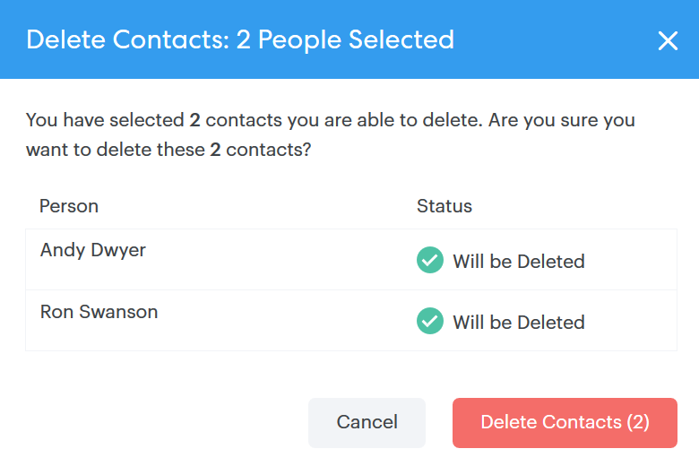

# リードに対する一括アクション {#bulk-actions-on-people}

連絡先を一括で使用して時間を節約するには、いくつかの操作が可能です。

使用可能な一括アクションの最初の手順は、2 つ以上の連絡先を選択し、縦並びの 3 つのドットをクリックすることです。

## リードをグループに追加 {#add-people-to-group}

複数のリードを 1 つのグループに同時に追加します。

## ソース {#source}

データベースに入るすべての連絡先に、ソースを自動的に割り当てます。この手順を使用して、そのソースを更新します。

>[!NOTE]
>
>ソースはカスタマイズできません。

## 認証 {#authorization}

[GDPR](https://eugdpr.org/) に準拠して、認証を使用してこれらの連絡先と関与する権限を受け取る方法を示します。

## 配信停止 {#unsubscribe}

今後連絡を希望しない連絡先に対して、一括登録解除を実行します。

## 削除 {#delete}

連絡先を一括で削除します。完全な手順は[こちら](/help/marketo/product-docs/marketo-sales-connect/people/managing-contacts/creating-and-deleting-contacts.md)にあります。

