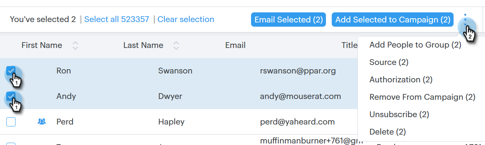
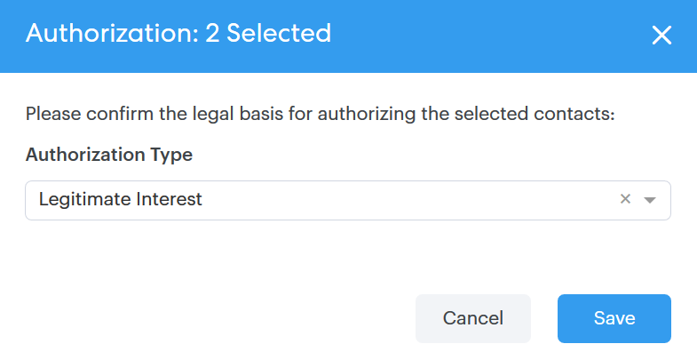

# 人物に対する一括アクション {#bulk-actions-on-people}

取引先責任者を一括で使用して時間を節約するには、いくつかの操作が可能です。

使用可能な一括アクションの最初の手順は、2 つ以上の取引先責任者を選択し、縦並びの 3 つのドットをクリックすることです。

## 人物をグループに追加 {#add-people-to-group}

複数の人物を 1 つのグループに同時に追加します。

## ソース {#source}

データベースに入るすべての取引先責任者に、ソースを自動的に割り当てます。 この手順を使用して、そのソースを更新します。

>[!NOTE]
>
>ソースはカスタマイズできません。

## 認証 {#authorization}

[GDPR](https://eugdpr.org/) に準拠して、認証を使用してこれらの取引先責任者と関与する権限を受け取る方法を示します。

## 配信停止 {#unsubscribe}

今後連絡を希望しない取引先責任者に対して、一括登録解除を実行します。

## 削除 {#delete}

取引先責任者を一括で削除します。 完全な手順は[こちら](/help/marketo/product-docs/marketo-sales-connect/people/managing-contacts/creating-and-deleting-contacts.md)にあります。

