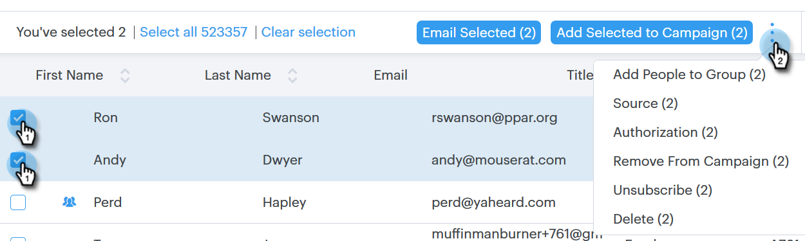
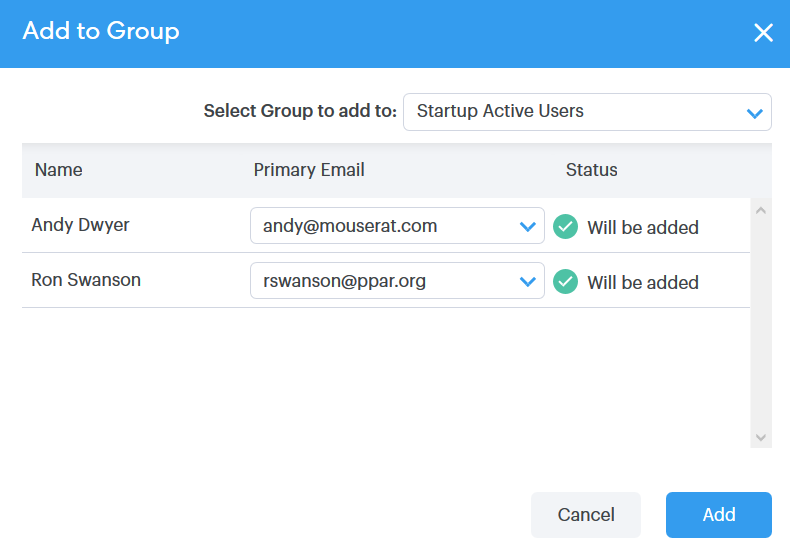
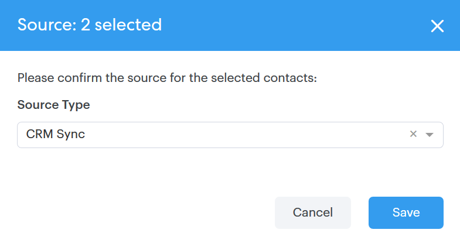
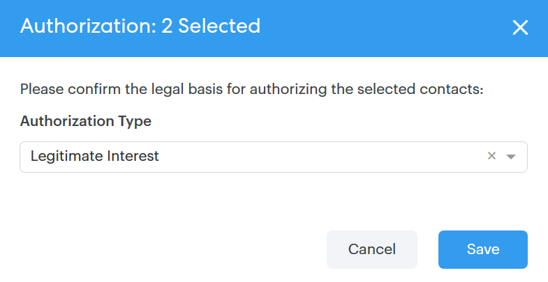
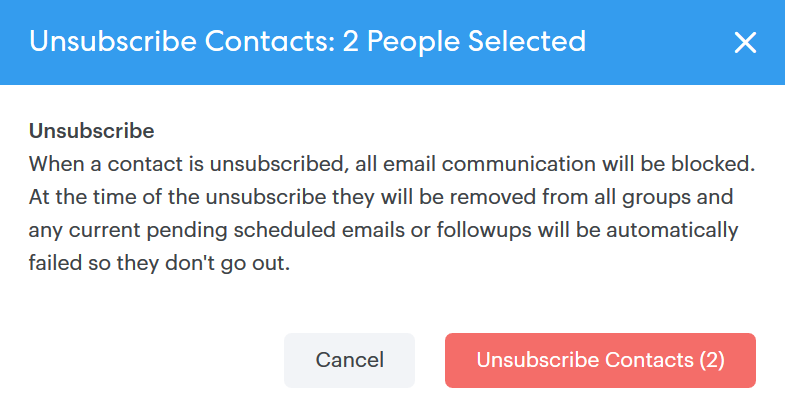
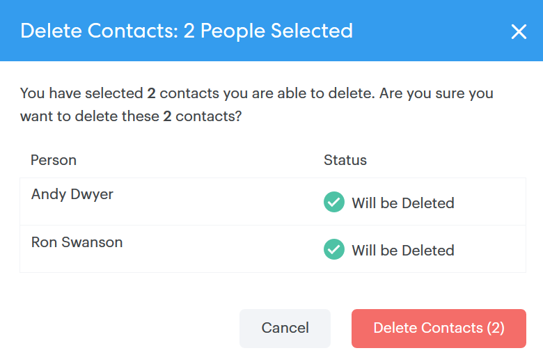

# 人物に対する一括アクション {#bulk-actions-on-people}

取引先責任者に対して一括で実行できる操作がいくつかあり、時間を節約できます。

利用可能なすべての一括アクションにおいて、まず 2 つ以上の取引先責任者を選択し、ドット（縦に並んだ 3 つの点）をクリックします。

## 人物をグループに追加&#x200B; {#add-people-to-group}

複数の人物を同時に 1 つのグループに追加します。

## ソース {#source}

データベースに追加されたすべての取引先責任者に、ソースを自動的に割り当てます。 この手順を使用して、そのソースを更新します。

>[!NOTE]
>
>ソースはカスタマイズできません。

## 認証 {#authorization}

[GDPR](https://eugdpr.org/) に準拠して、認証を使用してこれらの取引先責任者と関与する権限を受け取る方法を示します。

## 配信停止 {#unsubscribe}

今後連絡を希望しない取引先責任者に対して、一括登録解除を実行します。

## 削除 {#delete}

取引先責任者を一括で削除します。 完全な手順は[こちら](/help/marketo/product-docs/marketo-sales-connect/people/managing-contacts/creating-and-deleting-contacts.md)にあります。

