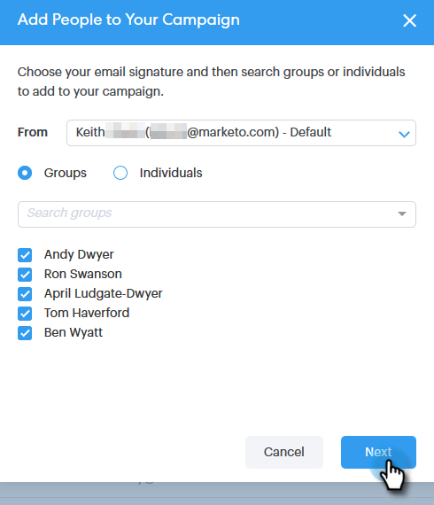

# グループとの接続 {#connecting-with-a-group}

グループ全体に電子メールを送信する方法、またはキャンペーンにグループを追加する方法について説明します。

## グループアクション：電子メール {#group-action-email}

1. 電子メールで送信するグループを選択します。

   

1. 「 **グループアクション** 」ボタンをクリックし、「 **電子メールグループ**」を選択します。

   

1. 電子メールに入力し、スケジュールを設定して送信します。

   

   それで終わり。 そのグループの全員が電子メールを受け取ります。

## グループアクション：販売追加キャンペーン {#group-action-add-to-sales-campaign}

1. キャンペーンに追加するグループを選択します。

   

1. 「 **Group Actions** 」ボタンをクリックし、「 **Group toキャンペーン**」を選択します。

   

1. 適切なユーザーが選択されていることを確認し、「 **次へ**」をクリックします。

   

   >[!NOTE]
   >
   >Marketorキャンペーンに追加するオプションが表示される場合があります。 [それは別の記事です](http://docs.marketo.com/x/CwDh)。

1. キャンペーンを選択し(結果を絞り込むカテゴリを選択できます)、「 **次へ**」をクリックします。

   

1. 必要な編集を行い、「 **次へ**」をクリックします。

   

1. キャンペーンをスケジュールし、「 **開始**」をクリックします。

   

