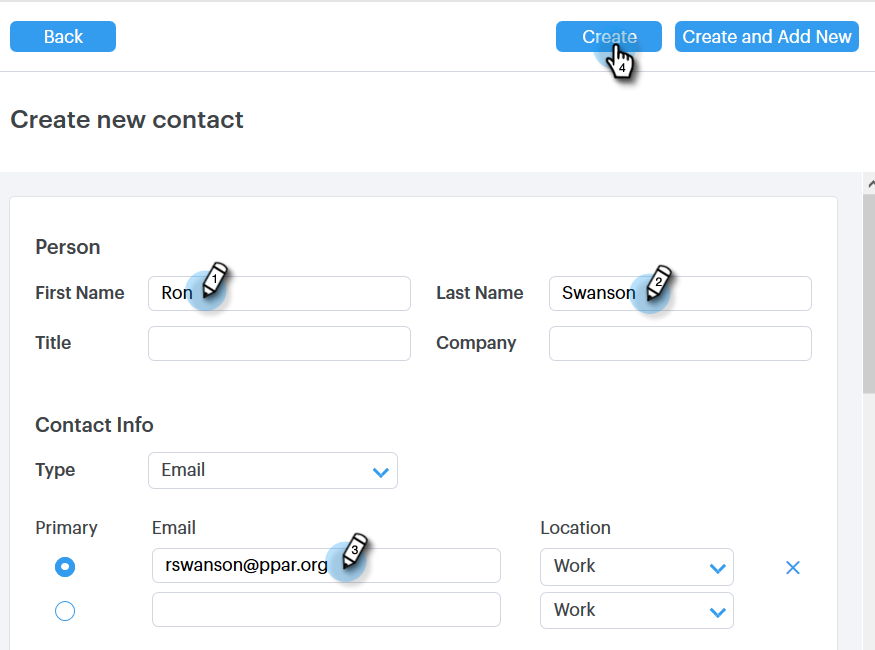
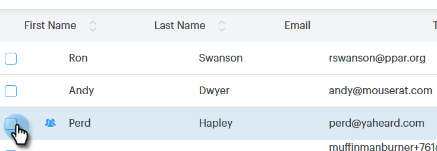

# 連絡先の作成と削除{#creating-and-deleting-contacts}

## 連絡先を作成{#creating-contacts}

1. ユーザーページで、「**グループアクション**」ボタンをクリックし、「**連絡先を作成**」を選択します。

   

1. 姓と名と電子メールアドレス、および必要な他の情報を入力します。 完了したら「**作成**」をクリックします。連絡先を追加するには「**作成して追加新規作成**」をクリックします。

   

   >[!TIP]
   >
   >複数の連絡先を一度に追加する場合 [CSVを使用して連絡先をインポートする方法につ](http://docs.marketo.com/x/VADb) いては、ここをクリックしてください。

## 連絡先を削除{#deleting-contacts}

1. 人ページで、削除する連絡先のボックスをオンにします。

   

   >[!NOTE]
   >
   >複数の連絡先を削除するには、複数の人を選択します。 残りの手順は同じです。

1. dota（縦に3つのドット）をクリックし、「削除」を選択します。

   

1. 「連絡先を削除」をクリックして確認します。

   
