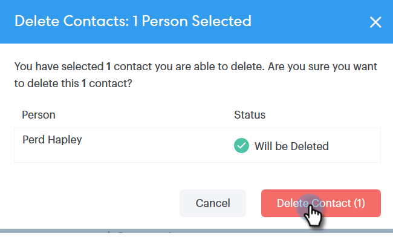

# 取引先責任者の作成と削除 {#creating-and-deleting-contacts}

## 連絡先の作成 {#creating-contacts}

1. 人物ページで、「**グループアクション**」ボタンをクリックし、「**連絡先を作成**」を選択します。

   

1. 姓名とメールアドレスおよび他に必要な情報を入力します。完了したら、「**作成**」をクリックするか、さらに取引先責任者を追加する場合は、「**作成して新たに追加**」をクリックします。

   

   >[!TIP]
   >
   >複数の取引先責任者を一度に追加する場合は、[こちらをクリック](/help/marketo/product-docs/marketo-sales-connect/people/managing-contacts/import-contacts-via-csv.md)して、CSV 経由で取引先責任者をインポートする方法を参照してください。

## 連絡先の削除 {#deleting-contacts}

1. 人物ページで、削除する連絡先のボックスをオンにします。

   

   >[!NOTE]
   >
   >複数の連絡先を削除するには、複数の人物を選択するだけです。残りの手順は同じです。

1. 縦並びの 3 つのドットをクリックし、「**削除**」を選択します。

   

1. 「**連絡先を削除**」をクリックして確定します。

   
