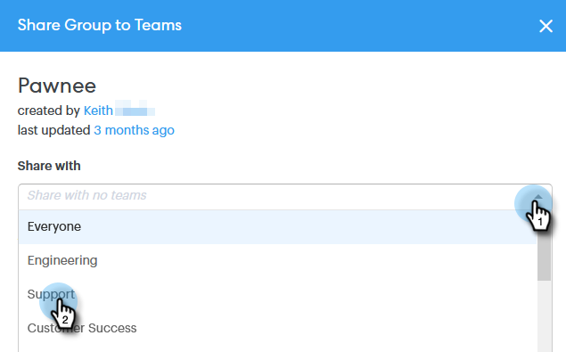

# グループを共有する方法 {#how-to-share-a-group}

リードや連絡先のグループをチームと共有するのは、Sales Connectで簡単です。

1. 「 **人物** 」タブに移動します。

   

1. 共有するグループを選択します。

   

1. 「** Group Actions**」ボタンをクリックし、「 **Share Group**」を選択します。

   

1. 共有するサブチームを選択し、チームのメモを追加します。

   

1. 「 **共有**」をクリックします。

   

