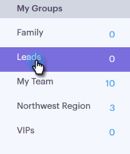
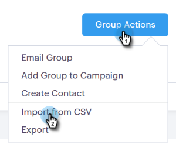
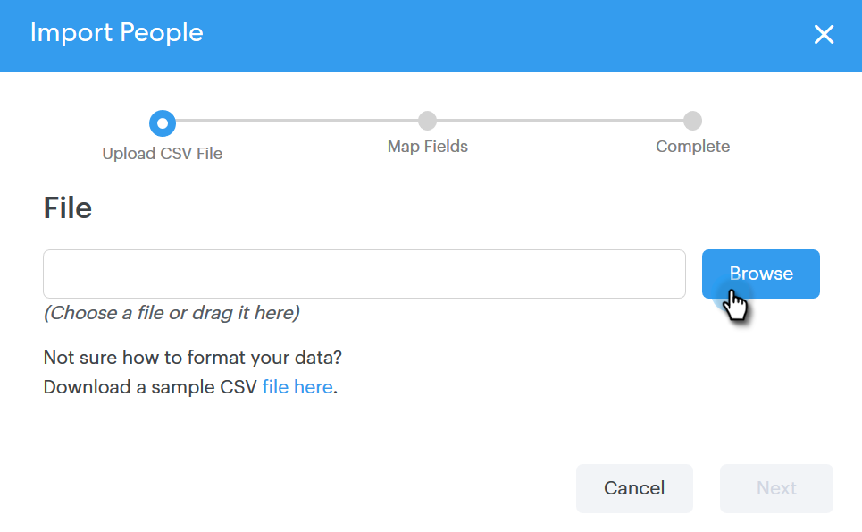
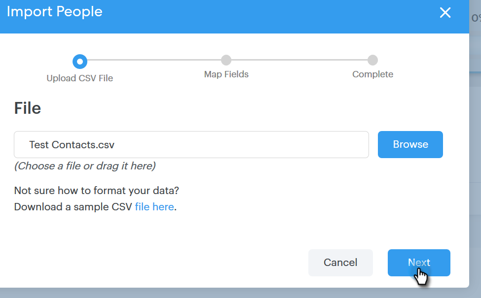
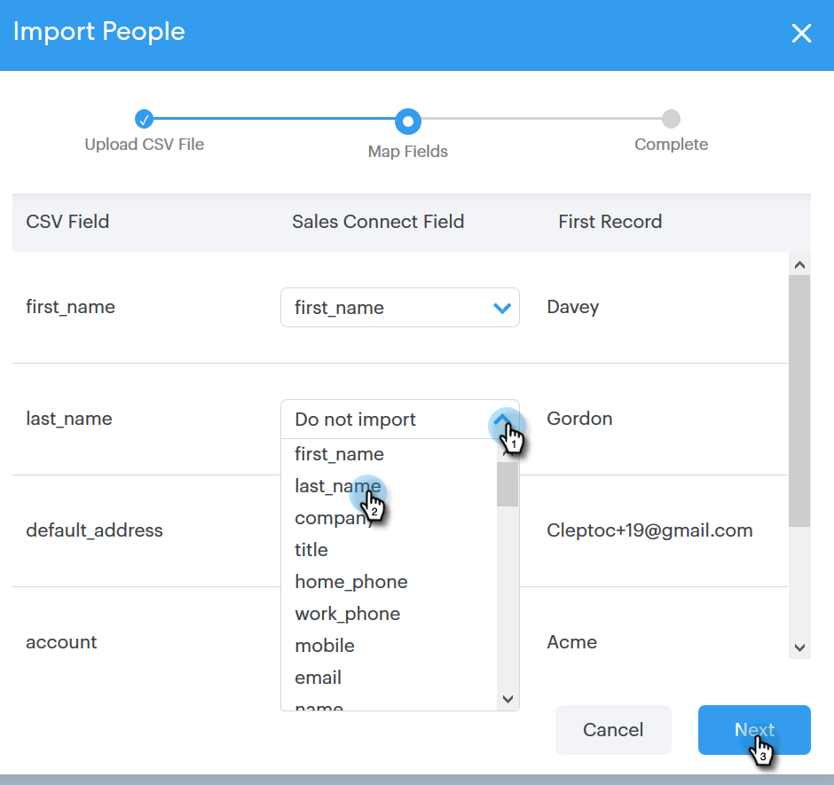

# CSV からの取引先責任者の読み込み {#import-contacts-via-csv}

[!UICONTROL 人物] ページに連絡先を持つことは、テンプレートの動的フィールドにパーソナライズされた情報を自動入力するためにから取得する場所であるため重要です。 CSV の各取引先責任者に少なくとも名前とメールアドレスが設定されていること、それらのフィールドにマッピングされていることを確認してください。

1. 「[!UICONTROL 人物]」タブで自分のグループを選択（または新しく作成）します。

   

1. 「**[!UICONTROL グループアクション]**」をクリックし、「**[!UICONTROL CSV から読み込む]**」を選択します。

   

1. 「**[!UICONTROL 参照]**」をクリックします。

   

1. お使いのコンピューター上でファイルを探し、選択します。

   >[!NOTE]
   >
   >グループの連絡先は 1000 件に制限されています。

1. 「**[!UICONTROL 次へ]**」をクリックします。

   

1. CSV の列を [!DNL Sales Connect] の各フィールドにマッピングします。 終了したら「**[!UICONTROL 次へ]**」をクリックします。

   
