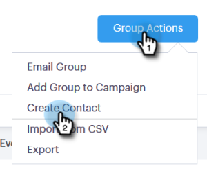

# グループの管理 {#manage-groups}

Sales Connectでグループを管理する方法を説明します。

## グループの作成 {#create-a-group}

1. 人ページで、「グループ」の横の **プラス記号** (+)をクリックします。

   

1. グループに名前を付け、「 **作成**」をクリックします。

   

   それだ！

## グループ追加の連絡先 {#add-contacts-to-a-group}

1. 人ページで、人を追加するグループを探して選択します。

   

1. 「 **グループアクション** 」をクリックし、「連絡先 **を作成**」を選択します。

   

   >[!NOTE]
   >
   >これにより、一度に1人の連絡先が追加されます。 複数の連絡先を同時に追加するには、次の手順に従い [ます](http://docs.marketo.com/x/VADb)。

1. 連絡先の情報を入力し、「 **作成** 」(別の情報を追加するには「 **作成して新規作成」** )をクリックします。

   

   終わった！

   >[!NOTE]
   >
   >新しい連絡先が追加された場合は、「更新」をクリックする必要があります。

## グループの共有 {#share-a-group}

1. 人ページで、共有するグループを見つけて選択します。

   

1. dota（縦に3つのドット）をクリックし、「 **共有**」を選択します。

   

1. ドロップダウンをクリックし、グループを共有するチームを選択します。

   

1. 「 **共有**」をクリックします。

   

   グループは引き続き所有していますが、「チームグループ」の下に表示されます。

## グループの共有解除 {#unshare-a-group}

1. 人ページで、共有を解除するグループを見つけて選択します。

   

1. dota（縦に3つのドット）をクリックし、「 **共有**」を選択します。

   

1. グループを共有したチームの **横にある** Xをクリックし、モーダルをクリックして外に出ます。

   

   グループは非共有になりました。

## グループ名の変更 {#rename-a-group}

1. 人ページで、名前を変更するグループを探して選択します。

   

1. ドット（縦に3つのドット）をクリックし、「 **名前の変更**」を選択します。

   

1. 新しい名前を入力し、enterを押します。

   

## グループの削除 {#delete-a-group}

1. 人ページで、削除するグループを探して選択します。

   

1. dota（縦に3つのドット）をクリックし、「 **削除**」を選択します。

   

1. 「 **削除** 」をクリックして確定します。

   

