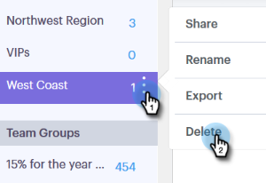

# グループの管理 {#manage-groups}

Sales Connect でグループを管理する方法を説明します。

## グループの作成 {#create-a-group}

1. 人物ページで、グループの横の「**+**」アイコンをクリックします。

   

1. グループに名前を付け、「**作成**」をクリックします。

   

   これで完了です。

## グループに連絡先を追加 {#add-contacts-to-a-group}

1. 人物ページで、人物を追加するグループを探して選択します。

   

1. 「**グループのアクション**」を選択し、「**連絡先を作成**」を選択します。

   

   >[!NOTE]
   >
   >これにより、一度に 1 件の連絡先が追加されます。複数の連絡先を同時に追加するには、[これらの手順](/help/marketo/product-docs/marketo-sales-connect/people/managing-contacts/import-contacts-via-csv.md)に従います。

1. 連絡先の情報を入力し、「**作成**」（または別のを追加する場合は「**作成して新たに追加**」）をクリックします。

   

   これで完了です。

   >[!NOTE]
   >
   >新しく追加された連絡先を表示するには、「更新」を押す必要がある場合があります。

## グループの共有 {#share-a-group}

1. 人物ページで、共有するグループを見つけて選択します。

   

1. 縦並びの 3 つのドットをクリックし、「**共有**」を選択します。

   

1. ドロップダウンをクリックし、グループを共有するチームを選択します。

   

1. 「**共有**」をクリックします。

   

   グループは引き続き所有していますが、チームグループで表示されます。

## グループの共有解除 {#unshare-a-group}

1. 人物ページで、共有を解除するグループを見つけて選択します。

   

1. 縦並びの 3 つのドットをクリックし、「**共有**」を選択します。

   

1. 次をクリック：グループを共有したチームの横にある「**X**」をクリックし、モーダルの外側をクリックします。

   

   グループの共有が解除されます。

## グループ名の変更 {#rename-a-group}

1. 人物ページで、名前を変更するグループを見つけて選択します。

   

1. 縦並びの 3 つのドットをクリックし、「**名前を変更**」を選択します。

   

1. 新しい名前を入力し、Enter キーを押します。

   

## グループの削除 {#delete-a-group}

1. 人物ページで、削除するグループを見つけて選択します。

   

1. 縦並びの 3 つのドットをクリックし、「**削除**」を選択します。

   

1. 「**削除**」をクリックして確定します。

   
